<p align="center">
  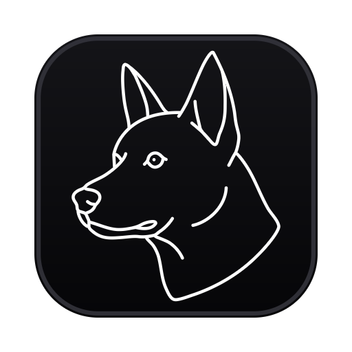
</p>

<h1 align="center">Kelpi</h1>

<p align="center"><strong>A terminal multiplexer built for driving fleets of AI agents.</strong></p>

<p align="center">
  <a href="https://github.com/benfriebe/kelpi/releases/latest"></a>
  
</p>

Kelpi (kelpi.sh) gives every agent a named pane, tells you which ones are running and which are
waiting for you, and lets agents drive each other with the `kelpi` CLI. A daemon owns every shell,
so closing the window, restarting the app or updating it never kills an agent.

## Tour


**Agents at work.** A coordinator splits off two workers with `kelpi pane split`, hands them work
with `kelpi pane send` and reads the fleet back with `kelpi pane list`. Each pane's dot, the sidebar
and the status bar show which agents are running and which are waiting for you. The `Acme` group
carries a default repository, so every workspace in it starts in `acme-web`.

<table>
  <tr>
    <td width="50%" valign="top">
      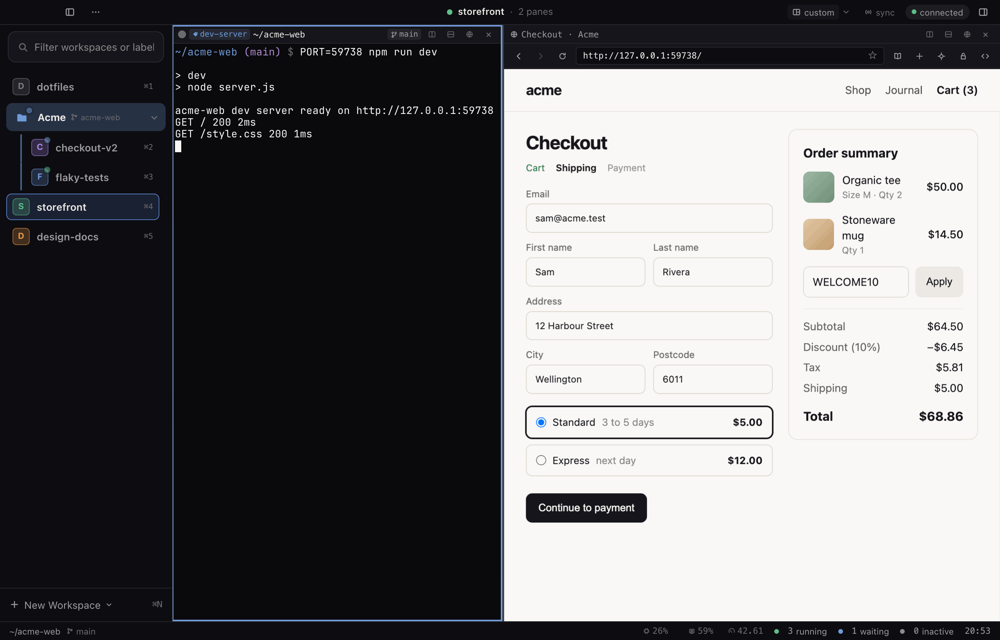
      <p><b>A browser beside the code.</b> <code>kelpi web open</code> puts a real Chromium page next to the dev server. Agents can read it, click it, watch its console and screenshot it with <code>kelpi web …</code>.</p>
    </td>
    <td width="50%" valign="top">
      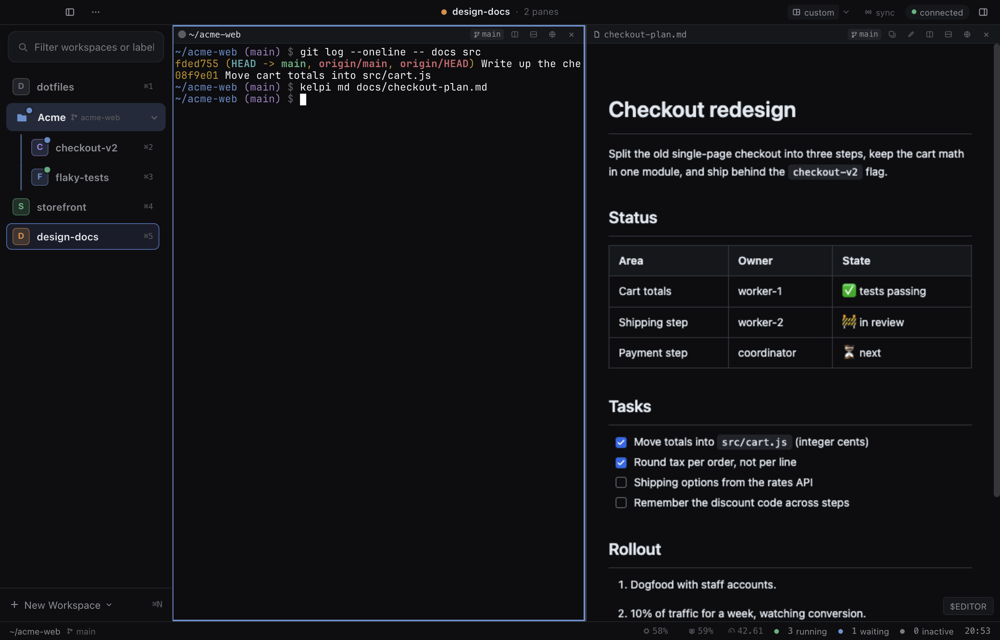
      <p><b>Markdown next to the terminal.</b> <code>kelpi md docs/checkout-plan.md</code> opens a live preview, with the editor a click away. Scratchpad and diff panes open beside your terminals too.</p>
    </td>
  </tr>
  <tr>
    <td width="50%" valign="top">
      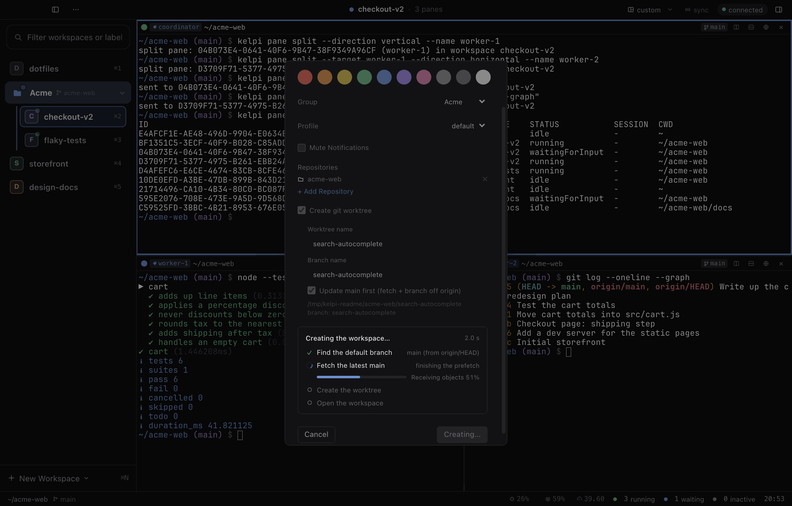
      <p><b>A worktree per task.</b> New Workspace in a group with a repository cuts a git worktree off the latest <code>origin/main</code> and shows each step as it runs, with Cancel leaving nothing behind.</p>
    </td>
    <td width="50%" valign="top">
      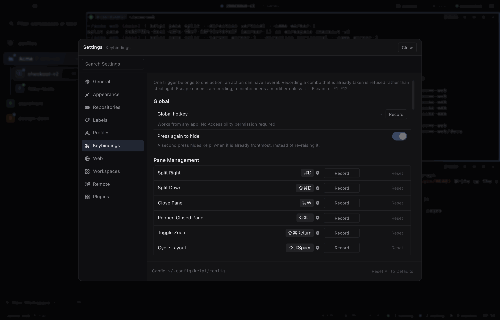
      <p><b>Settings, applied live.</b> Keybindings with conflict detection, appearance, terminal themes and repositories, edited in the window and kept in <code>~/.config/kelpi/config</code>.</p>
    </td>
  </tr>
</table>

The pictures in this README come from a sandboxed Kelpi that `scripts/readme-screenshots.mjs`
stages: real git repositories, real commands, the real CLI and the example plugin. No agent runs
in them; the pane status comes from `kelpi event`, the command the Claude Code and Codex hooks
call.

## Plugins

Plugins let you make Kelpi your own. A plugin can add its own panes, replace either sidebar, the
toolbar, the status bar or the bottom panel, draw terminal, browser and document panes its own
way, and use the daemon's commands, events and services from a backend that keeps running with
no window open. Plugins are trusted code, developed anywhere and installed as local directories
or portable `.kelpi-plugin` packages, and they need no build step.

<table>
  <tr>
    <td width="50%" valign="top">
      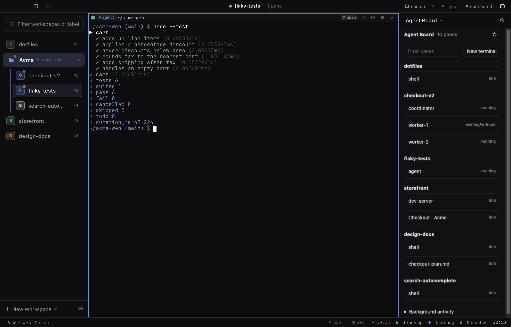
      <p><b>A sidebar of your own.</b> The <a href="examples/plugins/agent-board">Agent Board</a> example, a few dozen lines of plain HTML and JavaScript, replaces the right sidebar with a live list of every pane in every workspace and its agent's status.</p>
    </td>
    <td width="50%" valign="top">
      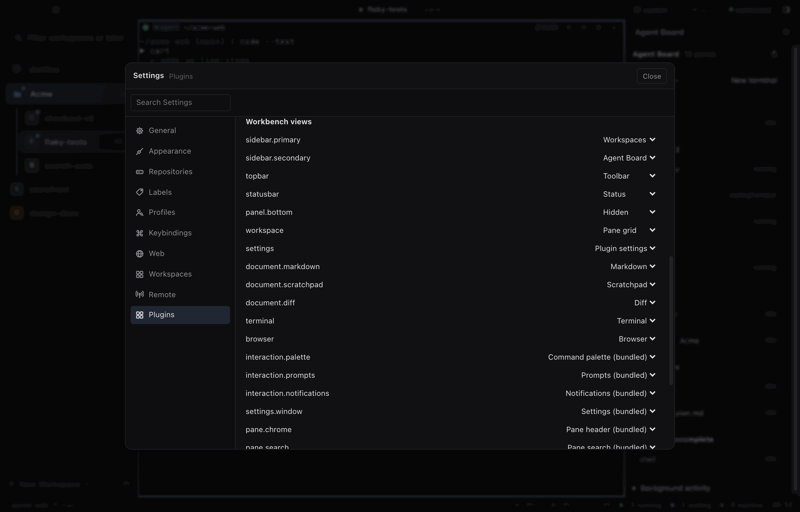
      <p><b>Every slot is replaceable.</b> Settings ▸ Plugins ▸ Workbench views lists each part of the window, from the sidebars and bars to the terminal, browser and document panes and the command palette, and takes the bundled view or any plugin's.</p>
    </td>
  </tr>
</table>

Make your own from a template, and keep it installed while you edit:

```bash
kelpi plugin init ~/code/my-pane --id me.my-pane --name "My Pane" --template pane
kelpi plugin dev ~/code/my-pane --trust      # reinstalls on every save
kelpi plugin open me.my-pane me.my-pane.home
```

The other templates are `sidebar`, `document` and `browser`.

The [plugin roadmap](docs/plugin-roadmap.md) tracks the overall plan, merged phases and
remaining work. Start with the [development guide](docs/plugin-development.md) to create a
plugin and test it beside an installed Kelpi; use the [API guide](docs/plugins.md) for supported
contracts and the [validation record](docs/plugin-validation.md) for results and evidence.
The [Agent Board example](examples/plugins/agent-board) demonstrates a custom pane and
workbench views. The [agent handoff](docs/plugin-handoff.md) records the current branch/PR,
integration baseline, validation limits and the next implementation task.

This generation uses protocol 2 and `kelpi-v2.db`; see the
[database upgrade notes](docs/plugins.md#database-and-protocol-upgrade) and the separate
[plugin revision recovery contract](docs/plugins.md#updates-and-recovery).

## Themes

<table>
  <tr>
    <td width="33%" valign="top" align="center">
      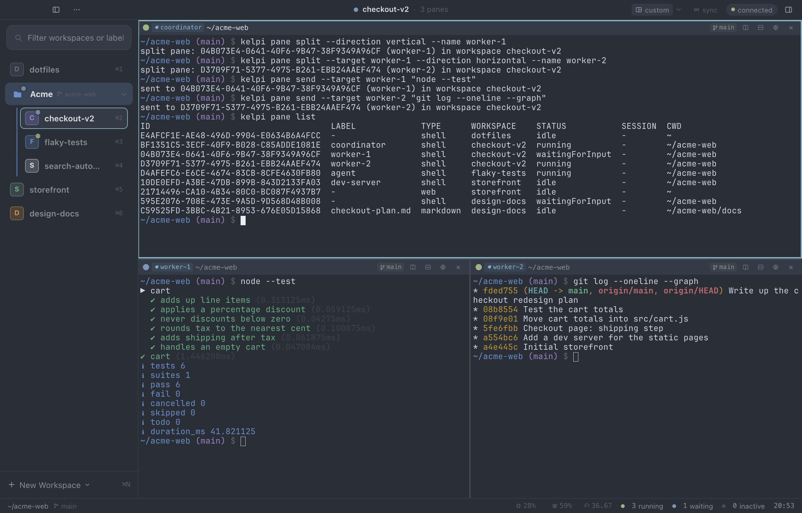
      <b>Nord</b>
    </td>
    <td width="33%" valign="top" align="center">
      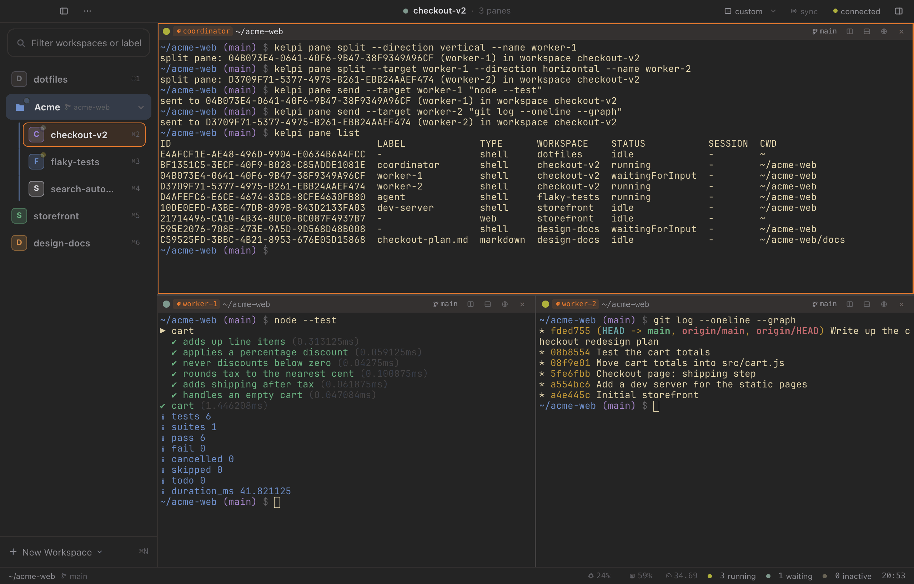
      <b>Gruvbox Dark</b>
    </td>
    <td width="33%" valign="top" align="center">
      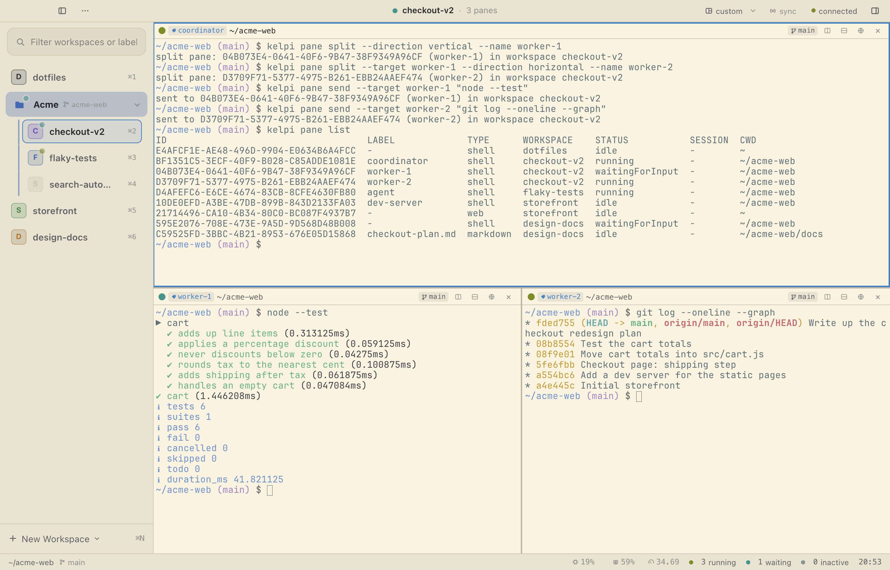
      <b>Solarized Light</b>
    </td>
  </tr>
</table>

The workspace from the tour, three ways, each a preset paired with the terminal theme of the same
name. In Settings ▸ Appearance, a preset theme (Dracula, Nord, Gruvbox Dark, Tokyo Night,
Catppuccin Mocha, Solarized Light or Gruvbox Light) recolours the sidebar, title bar, status bar
and agent dots in one click and switches between light and dark to suit. The terminal theme
beside it picks one of ten built-in palettes, saved as `theme = <name>` in
`~/.config/ghostty/config` and read from Ghostty's theme files. Your own colours can be saved and
shared as a theme file or a one-line code.

## Examples

Every command below runs from any shell inside a Kelpi pane. Panes that the CLI creates open in
the background, so an agent spawning workers never moves your cursor; add `--focus` when you do
want to jump to the new pane.

Spawn workers from a coordinator agent's pane, start agents in them, and read their output:

```bash
kelpi pane split --name worker-1
kelpi pane split --target worker-1 --direction vertical --name worker-2
kelpi pane send --target worker-1 'claude "Fix the flaky test in test/cart.test.js"'
kelpi pane send --target worker-2 'codex "Add a shipping step to the checkout"'
kelpi pane capture --target worker-1 --lines 40
kelpi pane list
kelpi pane split --name logs --focus      # this one takes the cursor
```

Give each task its own workspace on a fresh worktree:

```bash
kelpi workspace create --name fix-login --worktree fix-login --update-main

# or let a group carry the repository, so every new workspace in it starts there
kelpi group create Acme
kelpi group set-repo Acme ~/code/acme-web --worktree
kelpi workspace create --name search --worktree search --group Acme

kelpi workspace rename fix-login "fix-login: SSO redirect"
```

Drive a web pane, from you or from an agent:

```bash
kelpi web open http://localhost:5173
kelpi web capture --mode text
kelpi web capture --mode screenshot
kelpi web console --level error
```

Wire Claude Code and Codex into pane status, session resume and notifications, then check the
whole chain:

```bash
kelpi install-hooks
kelpi doctor
```

[`docs/cli.md`](docs/cli.md) specifies every command, and the bundled `kelpi-agentic` skill
teaches Claude Code to orchestrate panes this way.

## Install

1. Download `Kelpi-<version>-arm64.dmg` from the
   [latest release](https://github.com/benfriebe/kelpi/releases/latest) (Apple silicon). It's
   signed and notarized.
2. Open the DMG and drag **Kelpi** into **Applications**. Run it from there: a copy running from
   the DMG, or from Downloads, can't update itself.
3. Install the `kelpi` command: tray ▸ **Install CLI**. If `/usr/local/bin` isn't writable, run
   the `sudo ln -sfn …` command it prints. Then `kelpi install-hooks` wires Claude Code and
   Codex into Kelpi (see [Hooks](#hooks-kelpi-install-hooks)).
4. Optional: Settings ▸ General ▸ Updates ▸ **Check for updates automatically**. Kelpi ▸
   **Check for Updates…** works any time.

To build it yourself, see [From source](#from-source-development) and
[As an app](#as-an-app-pnpm-dist).

## Architecture

**Kelpi** (kelpi.sh) is a terminal multiplexer built for driving fleets of AI agents, with a
**daemon + web client** architecture. It is a ground-up port of **Nex** (the macOS terminal
multiplexer built on SwiftUI + libghostty), rebuilt around a daemon and renamed Kelpi, at full
feature parity with the app it replaces.

The daemon (`kelpid`) owns the sessions: PTYs, terminal state, workspaces, layouts and agent
tracking live in a headless Node process that survives app restarts and updates. Clients attach
to it and render: an Electron shell on the desktop, or any browser over a tailnet. Closing the
laptop lid or updating the app never kills an agent.

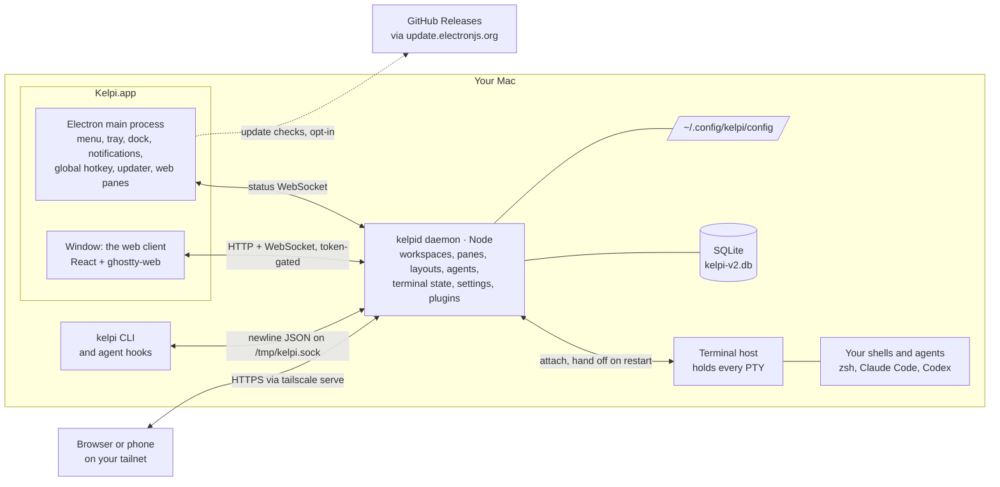

- **The daemon is the app.** Everything that matters lives in `kelpid`, and every client is a
  view of it: the desktop window, a browser, a phone. The daemon serves the web client itself, so
  the UI and the daemon always match.
- **Shells live in a separate terminal host.** A daemon restart, a promote or an app update hands
  every running terminal to the next daemon: same process, same screen, nothing typed into a
  live agent ([`docs/terminal-host.md`](docs/terminal-host.md)). Only `kelpid stop` ends them.
- **The Electron shell is thin, and has no preload.** The window's page and the main process
  never talk directly. Anything between them (menus, native pickers, dropped files' paths, the
  update sheet) goes through the daemon ([`packages/daemon/src/ws/desktop.ts`](packages/daemon/src/ws/desktop.ts)).
- **The CLI and agent hooks speak the same control protocol**, so agent tracking works with no
  window open at all.

[`ARCHITECTURE.md`](ARCHITECTURE.md) has the full process model.

## What Kelpi is today

- **Workspaces, groups and panes** with a full layout tree (splits, focus, sidebar ordering,
  collapse state), persisted to SQLite and restored across daemon restarts: panes come back, and
  every pane with a tracked agent session resumes it (`claude --resume <id>` / `codex resume <id>`).
- **A real terminal**: each pane runs your login shell (so `~/.zprofile` and Homebrew's `PATH`
  apply, as in Terminal.app), rendered by the vendored `ghostty-web` engine, with the Kitty
  keyboard protocol, mouse reporting, IME/CJK composition, OSC 52 (writes behind a `clipboard-write` key that ships off,
  reads refused), search highlighting, themes, and per-pane font/size. One accepted limitation:
  the daemon's VT does not reflow on resize.
- **Content panes** beyond the shell: markdown (edit/preview), scratchpad, diff, and web panes
  (real Chromium via the shell, with console capture, screenshots, and an element picker).
- **Agent awareness**: lifecycle hooks from Claude Code and Codex CLI drive pane status, session
  ids and desktop notifications; `kelpi install-hooks` wires them and `kelpi doctor` verifies the
  whole chain.
- **Graft**: git-worktree-backed workspaces (default base `~/kelpi/worktrees/<repo>`), with repo
  associations and status surfaced in the UI. A **group can have a default repository**
  (group ▸ Add Repository…, or `kelpi group set-repo`): new workspaces in it start with that repo,
  and optionally with a new worktree branched off the latest `origin/main`, named after the
  workspace. The group header shows the repo.
- **A native shell**: menu bar, tray, dock badge, global hotkey, native notifications,
  hidden-titlebar window with inline traffic lights, an inspector, Finder "Open With" for
  markdown, native folder pickers (Settings ▸ Repositories), and **dropping files onto a terminal
  pane** to type their shell-escaped paths, so an agent receives them as a paste.
- **Updates that keep your sessions**: signed, notarized releases from GitHub, offered in a sheet
  with the release notes. Kelpi asks before restarting, and the new version adopts the running
  terminals. Off by default.
- **A settings system** over `~/.config/kelpi/config`: keybindings (with conflict detection),
  appearance, terminal themes, repositories, TCP exposure, edited live in the client, applied by
  the daemon as the settings authority.
- **The `kelpi` CLI**: a single-file, dependency-free binary speaking the daemon's newline-JSON
  control protocol: panes, workspaces, groups, events, web-pane control, doctor, install-hooks,
  and the legacy importer. The daemon still passes the shipped Swift CLI's 103-test compat
  suite over TCP: same wire, different socket.
- **Self-hosting tooling**: an impact-mapped verification battery, a promote flow that upgrades
  the running instance from inside itself, a second full instance for development, and a
  sub-second HMR loop.

## Naming

Everything is **Kelpi**: the app is `Kelpi.app`, the CLI is `kelpi`, the daemon is `kelpid`, the
packages are `@kelpi/*`, the socket is `/tmp/kelpi.sock`, panes carry `KELPI_PANE_ID` /
`KELPI_PROFILE` / `KELPI_SOCKET`, the config is `~/.config/kelpi/config`, the daemon's state is
`~/Library/Application Support/kelpid/kelpi-v2.db`, new worktrees go under `~/kelpi/worktrees/`, and
the bundled Claude Code skill is `kelpi-agentic`.

**Nothing is shared with Nex.** The Swift app keeps `/tmp/nex.sock`, its `NEX_*` pane
variables, `~/.config/nex` and `~/Library/Application Support/Nex`; Kelpi has its own of each,
and the two apps run side by side without touching one another. The bridge between them is
**`kelpid import`**: it copies the data (from the Swift app's database, or a pre-rename port
daemon's `nexd/nex.db`; it reads both generations) and the config into Kelpi's locations, once,
explicitly, with a printed report. See "Importing from the legacy macOS app" below.

Two conveniences remain for our own pre-rename install base, neither shared with the Swift app:
`/usr/local/bin/nex` links that THIS app's earlier builds installed are healed (never created,
and a Swift-owned link is never touched), and `kelpi install-hooks` migrates hook entries to the
`kelpi` spelling when re-run.

## Quickstart

Requires Node 24 and the pnpm that `packageManager` in `package.json` names, pnpm 10.28.1; pnpm
and corepack both honour that field and switch to it. The pin is load-bearing: pnpm 11 removed
`onlyBuiltDependencies` in favour of `allowBuilds`, so it would leave node-pty and electron
unbuilt, it moves the lockfile to another generation, and the report this came from has it
refusing electron-forge's `@electron/node-gyp` git subdependency. The `ghostty-web` override is
the one part that travels: pnpm 10 and 11 both read `overrides` from `pnpm-workspace.yaml`, which
is why it lives there rather than in the `package.json` `pnpm` field pnpm 11 stopped reading.

A fresh clone or worktree needs nothing but the install below. The vendored terminal engine's
bundle is tracked, and `pnpm vendor:build` regenerates it when the vendor source changes. The
detail is in [prepare the source checkout](docs/plugin-development.md#prepare-a-source-checkout).
To run beside an installed Kelpi, use the
[private-instance launcher](docs/plugin-development.md#start-a-private-instance).

```bash
pnpm install --frozen-lockfile
pnpm --filter @kelpi/daemon build        # esbuild → packages/daemon/dist/kelpid.js
```

Start the daemon. It detaches by default, so it outlives the shell that started it:

```bash
packages/daemon/dist/kelpid.js start
packages/daemon/dist/kelpid.js status
```

```
kelpid is running (pid 77182)
  version: 0.3.0-dev (build 1)
  protocol: 2
  control: /tmp/kelpi.sock
  discovery: ~/Library/Application Support/kelpid/run/daemon-v2.sock
  http: http://127.0.0.1:59329
  url: http://127.0.0.1:59329/?token=8f3c…
  run dir: ~/Library/Application Support/kelpid/run
```

Open the client with the `url` line, never the bare `http:` one: the WebSocket handshake is
gated on the run dir's token, so an origin without `?token=` loads the page and is then refused
(the client says so and stops, rather than retrying). `kelpid url` prints exactly that line and
nothing else, so it pipes:

```bash
open "$(packages/daemon/dist/kelpid.js url)"
```

The token is remembered in `localStorage` and stripped from the address bar on arrival, so
later visits to the bare origin work, until the daemon's run dir is recreated, at which point
open a fresh `kelpid url` again.

`--foreground` runs it in the current process instead (what a supervisor or a container wants),
and `kelpid stop` shuts it down cleanly: pending state is flushed to SQLite before the PTYs are
killed.

Shells do not have to die with the daemon. `kelpid start` runs every PTY in a separate **terminal
host** process, so `kelpid restart` (and a promote, or an app update) hands each running terminal
to the next daemon instead: same process, same screen, nothing typed into a live agent. `kelpid stop`
still ends everything. `KELPID_TERMINAL_HOST=0` keeps the old in-process behaviour. See
[docs/terminal-host.md](docs/terminal-host.md).

### Talking to it

Anything that speaks the control protocol works, including `nc`:

```bash
echo '{"command":"ping"}'           | nc -U /tmp/kelpi.sock
echo '{"command":"workspace-list"}' | nc -U /tmp/kelpi.sock
```

The CLI talks to whatever `KELPI_SOCKET` names. Point it at a development daemon over TCP:

```bash
# daemon: listen on loopback TCP as well as the unix socket
KELPID_TCP_PORT=19400 packages/daemon/dist/kelpid.js start

# CLI: reach it over that port
KELPI_SOCKET=tcp:127.0.0.1:19400 kelpi pane list
KELPI_SOCKET=tcp:127.0.0.1:19400 kelpi pane send --target worker-1 "echo hello"
```

The same variable is how a dev container or a remote agent reaches the daemon
(`KELPI_SOCKET=tcp:host.docker.internal:19400`, or an SSH reverse tunnel).

### The `kelpi` CLI

```bash
pnpm --filter @kelpi/cli build                          # → packages/cli/dist/kelpi.js
node packages/cli/dist/kelpi.js install-hooks --link    # symlink + Claude/Codex hooks
kelpi doctor                                            # daemon-aware: checks kelpid, not Kelpi.app
```

`dist/kelpi.js` is a single dependency-free file with a shebang, so it needs nothing installed
beside it. [`packages/cli/README.md`](packages/cli/README.md) covers the command surface and what
`doctor` checks.

### Hooks: `kelpi install-hooks`

Agent status, session ids and desktop notifications all come from lifecycle hooks that Claude
Code and Codex CLI fire; without them a pane never leaves "idle". `kelpi install-hooks` writes
the five Claude hooks into `~/.claude/settings.json` and, when `~/.codex` exists, the four Codex
hooks into `~/.codex/hooks.json`:

```bash
kelpi install-hooks --dry-run     # show what would change, write nothing
kelpi install-hooks               # merge (safe to re-run; this is what `kelpi doctor` suggests)
kelpi install-hooks --link        # …and symlink this CLI into /usr/local/bin first
```

It **merges**: your own hooks survive, kelpi-managed ones are deduped by their flag-less base
(so an old absolute-path or `nex`-spelled install is replaced rather than left to double-fire),
and a stale `"matcher": "startup"` SessionStart group is migrated to a matcher-less one so
`claude --resume` binds its session id again. An existing file is copied to `<file>.kelpi-backup`
before it changes, and a file that is not valid JSON is refused rather than overwritten. A
packaged `Kelpi.app` installs the symlink itself: on first launch it offers, on later launches
it repairs drift, and the tray's **Install CLI** item does it on demand.

**PATH assumption.** The hooks run in the *non-interactive* shell Claude Code spawns, which
does not read your `~/.zshrc` and inherits the agent's own `PATH`. `install-hooks` writes a bare
`kelpi` only when a `kelpi` on the current `PATH` really resolves to this binary; otherwise it
writes the absolute path, so the hooks fire either way. `--install-dir` / `KELPI_INSTALL_DIR`
move the symlink elsewhere, and an unwritable directory prints the `sudo` command to run by
hand; it never escalates on its own.

### Running a second daemon

The production control socket is `/tmp/kelpi.sock`; `kelpid` refuses to steal a live socket.
During development, give a daemon its own endpoints:

```bash
KELPID_SOCKET_PATH=/tmp/kelpid-dev.sock \
KELPID_TCP_PORT=19400 \
KELPID_DB_PATH=~/.local/share/kelpid-dev/kelpi.db \
KELPID_RUN_DIR=~/.local/state/kelpid-dev \
packages/daemon/dist/kelpid.js start --foreground
```

`KELPI_SOCKET` only selects a TCP endpoint (absent means the default `/tmp/kelpi.sock`), so TCP
is how a CLI reaches a development daemon:

```bash
KELPI_SOCKET=tcp:127.0.0.1:19400 kelpi workspace list
```

A development daemon has its own run dir, and therefore its own token, so ask that daemon for
its URL rather than reusing one from another instance:

```bash
KELPID_RUN_DIR=~/.local/state/kelpid-dev open "$(packages/daemon/dist/kelpid.js url)"
```

`kelpid --help` lists every environment override (run dir, control socket, TCP port, HTTP
host/port, database, config file, client build directory, log file).
`scripts/dev-instance.mjs` automates all of the above: it stands up a complete second Kelpi
(daemon + client + helpers) on private endpoints, beside the one you are using. Its panes run
your own shell with your real `HOME`, so they look like your everyday shells, while every piece of
daemon state stays under the instance's own directory; `--isolated-home` gives them an empty home
instead. Start it from a terminal whose `PATH` you want the panes to inherit.

Beside the database the daemon keeps `pane-geometry.json`: the last grid (cols × rows) each
pane was actually rendered at. It is a cache, not state, but it is what lets a restored pane's
shell be **born** at the size it will be shown at instead of at 80×24. The emulator does not
reflow, so a prompt printed at the wrong width stays wrong in every snapshot after it; deleting
the file costs one badly-wrapped first prompt per pane and nothing else.

## Importing from the legacy macOS app

The Swift app (Nex) keeps its state in `~/Library/Application Support/Nex/nex.db`; the daemon
owns a separate database (`~/Library/Application Support/kelpid/kelpi-v2.db`, or `KELPID_DB_PATH`)
so the two run side by side. `kelpid import` copies the legacy state into Kelpi's, once: the
database AND `~/.config/nex/config` (never over an existing Kelpi config). Its default source
is the pre-rename port daemon's `nexd/nex.db` when that exists (the reader handles both
generations), else the Swift app's.

The daemon must be stopped: it holds the whole state in memory and its next save would overwrite
whatever the import wrote. That is also the order that gets your sessions back:

```bash
kelpid stop
kelpid import          # or: kelpid import --dry-run   to see the report first
kelpid start
```

On that `start` the panes come back, and every pane that had an agent session resumes it:
`claude --resume <id>` or `codex resume <id>`, chosen by the pane's last-known agent. Session ids
that fail the shell-safety allowlist are skipped, and the report says which.

| flag | meaning |
|------|---------|
| `--from <db>` | legacy database (default: the Swift app's path above) |
| `--to <db>` | daemon database (default: `KELPID_DB_PATH`, else the platform default) |
| `--force` | replace a target that already holds workspaces; the existing database is copied aside as `<target>.<timestamp>.bak` first |
| `--dry-run` | print the report and write nothing (not even an empty database) |
| `--json` | one JSON report on stdout; the two paths still go to stderr |

Both paths are printed before anything is opened. The source is opened **read-only** and is never
written, migrated or deleted, so importing twice (or importing into a scratch `--to`) is safe.
Without `--force`, a target that already holds workspaces is refused; a running daemon is refused
regardless of `--force`.

What comes across: workspaces (name, color, icon, labels, profile, layout tree, focused pane),
groups (order, collapse state, members), the sidebar order, panes of every type (shell, markdown,
scratchpad, diff, web) with their working directories, files, scratchpad contents and web tabs,
plus the repo registry and its associations. What does not: live pane statuses (reset to idle:
no PTY survives an import), private web-pane tabs (the private flag persists, the contents never
do), and parked/recently-closed panes. Undecodable rows are dropped and *reported*: `skipped`
names the table, id and reason, and `warnings` covers every fallback taken.

## Install and run

### From a release

See [Install](#install) above.

### From source (development)

The daemon is the only thing you strictly need; a browser is a complete client. The Electron
shell adds the native chrome (tray, dock badge, global hotkey, native notifications, web panes).

The install below is the whole preparation; see
[prepare the source checkout](docs/plugin-development.md#prepare-a-source-checkout) for the
pnpm version this repo pins and for rebuilding the vendored engine after a vendor change.

```bash
pnpm install --frozen-lockfile
pnpm --filter @kelpi/daemon build     # esbuild → packages/daemon/dist/kelpid.js
pnpm --filter @kelpi/cli build        # esbuild → packages/cli/dist/kelpi.js
pnpm --filter @kelpi/client build     # vite    → packages/client/dist
pnpm --filter @kelpi/shell build      # esbuild → packages/shell/dist/main.js

KELPID_CLIENT_DIR=packages/client/dist pnpm --filter @kelpi/shell start
```

`start` runs `electron .`, which discovers a running daemon or starts one detached (and leaves it
running when you quit). To use the browser instead, start the daemon yourself and open
`kelpid url` (see [Quickstart](#quickstart) above).

### As an app (`pnpm dist`)

```bash
pnpm dist                                          # daemon + client + CLI + shell, then electron-forge make
open packages/shell/out/Kelpi-darwin-arm64/Kelpi.app
```

`pnpm dist` builds all four bundles and produces, in `packages/shell/out/`:

| artifact | what it is |
|----------|------------|
| `Kelpi-darwin-arm64/Kelpi.app` | the app bundle (also what `open` above launches) |
| `make/Kelpi.dmg` | the DMG, for handing to another machine |
| `make/zip/darwin/arm64/Kelpi-darwin-arm64-<version>.zip` | the ZIP: Squirrel.Mac's format, which is what an update downloads |

Use `pnpm --filter @kelpi/shell package` for just the `.app` (no DMG/ZIP), and
`pnpm --filter @kelpi/shell smoke:packaged` to verify a build end to end: it packages the app,
launches it with a throwaway environment and asserts that it starts its own daemon, serves its
own client, answers the CLI, runs a real PTY, and leaves the daemon alive on quit.

**Quit hangs on macOS 26.4.x:** Electron can finish closing every window and emit `quit`
while its process remains stuck in native teardown. This also reproduces with a minimal
Electron app containing only a hidden `about:blank` window; see
[Electron #52582](https://github.com/electron/electron/issues/52582). The packaged smoke keeps
its clean-exit assertion strict: `exit code null, signal SIGKILL, quit wait 20000 ms, timed out true`
means the app failed to exit and the harness killed its isolated test process after the deadline.
Kelpi does not work around this by force-killing itself. The upstream reporter confirmed that
the same Electron binaries exited normally after
[updating macOS from 26.4.1 to 26.6](https://github.com/electron/electron/issues/52582#issuecomment-5152586801).
Re-run the packaged smoke after an OS update to verify shutdown on that machine.

Inside `Kelpi.app/Contents/Resources`:

```
app.asar     the shell: dist/main.js + package.json, and nothing else
daemon/      kelpid.js + node_modules/node-pty   ← outside the asar, on purpose
client/      the built web UI                    ← outside the asar
cli/         the kelpi CLI + its launchers       ← outside the asar
node         a Node 24 runtime for the daemon    ← outside the asar
```

The staged directories sit outside the archive because a plain `node` process (not Electron)
executes the daemon: `node` cannot run a script inside an asar, and `dlopen` cannot load
node-pty's `pty.node` out of one. On launch the shell finds its daemon at
`Resources/daemon/kelpid.js`, runs it under `Resources/node` (never `ELECTRON_RUN_AS_NODE`, which
is fused off), and hands it `KELPID_CLIENT_DIR=…/Resources/client`. All three are overridable
(`KELPID_ENTRY`, `KELPID_NODE`, `KELPID_CLIENT_DIR`), and a daemon that is *already* running is
adopted as-is, so a packaged app and a development daemon coexist.

Two things about the build worth knowing:

- **The bundled `node` is whichever Node built the app** (or `KELPI_NODE_BINARY`), copied in and
  checked for version and architecture. A release builds under `actions/setup-node`, so it
  bundles the official Node build, re-signed with Kelpi's identity (see below).
- **The icon is generated, not designed**: `src/packaging.ts` draws it and writes a real `.icns`,
  so a build never silently ships the stock Electron icon. Replacing it means dropping a designed
  `.icns` in and pointing `packagerConfig.icon` at it.

**Updates** come from GitHub Releases through `update.electronjs.org`, and they are **off by
default**: with Settings ▸ General ▸ Updates "Check for updates automatically" (`auto-update` in
`~/.config/kelpi/config`) off, the app makes no update request at all. On, it checks at launch
and asks **Update Now** or **Later**; nothing downloads until the answer is Update Now. Kelpi ▸
Check for Updates… asks the same question any time, whatever the setting. The whole flow is a
sheet centred in the Kelpi window, with the release notes rendered as markdown: the download shows
as in progress, and when it finishes Kelpi asks **Restart Now** or **Later** rather than quitting
by itself (Later installs it the next time you quit, and the Kelpi menu offers "Restart to
Update…" until then). Give Kelpi a few seconds to finish before reopening it: a copy opened too
soon is the old one. Kelpi refuses to update a copy it cannot replace, such as one running from
the mounted DMG or a translocated copy in Downloads, and says to move it to Applications. After the update the
app finds the old version's daemon still running and hands it off: the daemon passes its
terminals to the terminal host and exits, and the new version's daemon adopts them, so shells
and agents keep running (`packages/shell/src/update-flow.ts`, `packages/shell/src/updater.ts`,
`packages/shell/src/daemon.ts`, `docs/terminal-host.md`).

### Signing, notarization and releases

A plain `pnpm dist` is **ad-hoc signed** (an arm64 requirement, applied automatically). It runs
on the machine that built it, and that is what `scripts/self-upgrade.mjs` promotes. Any other
Mac quarantines it ("Kelpi is damaged and can't be opened").

A **release** is signed with a Developer ID, notarized and stapled. Pushing a `v<semver>` tag
runs `.github/workflows/release.yml`, which:

1. sets the app's version from the tag (`packages/shell/package.json`; Squirrel compares it
   with the release tags),
2. runs `pnpm dist` with the Developer ID and notarization credentials, which signs, notarizes
   and staples the app before the ZIP and DMG are made from it,
3. signs, notarizes and staples the DMG,
4. checks the app, the DMG and the app inside the ZIP with `codesign`, `stapler` and `spctl`,
5. drafts a GitHub Release with the DMG and the ZIP (Squirrel installs from the ZIP). Publishing
   the draft is manual.

What to know when cutting one:

- **Versions:** main carries the next version with `-dev` (for example `0.3.0-dev`), so a build
  from main never reads as older than a published release; the tag stamps the real version.
- **Offering an update:** installed copies are offered only a **published, non-prerelease**
  release. `update.electronjs.org` ignores drafts and prereleases, and can take up to about ten
  minutes to offer a newly published release.
- **After an update**, the new app hands the old version's daemon off to its own: the terminals
  carry over.

Running the workflow by hand does everything except the release and leaves the DMG and ZIP as
workflow artifacts. Its secrets live in the repo's `Kelpi` environment:
`DEVELOPER_ID_CERTIFICATE` (base64 of the Developer ID Application `.p12`),
`DEVELOPER_ID_PASSWORD`, `APPLE_ID` and `APPLE_ID_PASSWORD` (an app-specific password).

What signing does (`forge.config.cjs`, `signOptionsForFile` in `packages/shell/src/packaging.ts`):

- Every Mach-O file is signed inside-out under the **hardened runtime**, which notarization
  requires, and a signing failure fails the build. Resources are sealed by their bundle, not
  signed one by one.
- `Kelpi.app` carries a terminal's entitlements: microphone, camera, AppleScript, contacts,
  calendars, location and photos. Programs running in a pane are attributed to Kelpi, so
  without them a hardened Kelpi would deny Claude Code's voice mode or an `osascript` with no
  prompt at all.
- The bundled `node` gets the official Node build's entitlements minus `get-task-allow`, and
  node-pty's `spawn-helper` keeps `DYLD_*` variables flowing through to your shells.
- **`EnableCookieEncryption` turns on** with the identity, because that fuse needs a code
  identity stable enough for the keychain's ACL (`cookieEncryptionFuseEnabled`). Expect a
  one-time "Kelpi wants to use your confidential information stored in Kelpi Safe Storage"
  prompt on first launch, and run the packaged smoke with `--mock-keychain`.

To sign and notarize locally:

```bash
# once: save notarization credentials in the keychain (prompts for an app-specific password)
xcrun notarytool store-credentials kelpi-notary --apple-id <apple-id> --team-id 4ASXCG2599

KELPI_MACOS_IDENTITY="Developer ID Application: BENJAMIN RYAN FRIEBE (4ASXCG2599)" \
KELPI_NOTARY_PROFILE=kelpi-notary pnpm dist

KELPI_MACOS_IDENTITY="Developer ID Application: BENJAMIN RYAN FRIEBE (4ASXCG2599)" \
  node packages/shell/scripts/packaged-smoke.mjs --no-build --no-package --mock-keychain
spctl -a -vvv -t exec packages/shell/out/Kelpi-darwin-arm64/Kelpi.app
```

Leave out `KELPI_NOTARY_PROFILE` to sign without notarizing. Notarization also accepts an App
Store Connect API key (`APPLE_API_KEY`, `APPLE_API_KEY_ID`, `APPLE_API_ISSUER`) or an Apple ID
(`APPLE_ID`, `APPLE_ID_PASSWORD`, `APPLE_TEAM_ID`); a group set only in part fails the build
rather than shipping an unnotarized app.

Re-run the packaged smoke after any signing change, since a mis-signed bundle fails at launch,
not at build time. The final check is a Mac that never saw the build: open the DMG there.

### Remote access over Tailscale

The daemon listens on loopback only. `tailscale serve` fronts that port with HTTPS at
`https://<machine>.<tailnet>.ts.net`, reachable from any device on the tailnet (including a
phone), with certificates handled for you:

```bash
# the HTTP port the daemon actually bound
port=$(packages/daemon/dist/kelpid.js status --json | jq -r .http_port)

tailscale serve --bg "$port"     # background; foreground is the same command without --bg
tailscale serve status           # what is currently proxied
```

Then open it with the daemon's token: the tailnet only decides *who can reach the port*; the
WebSocket handshake is still gated on the run dir's token:

```bash
url=$(packages/daemon/dist/kelpid.js url)                                 # http://127.0.0.1:<port>/?token=…
host=$(tailscale status --json | jq -r .Self.DNSName | sed 's/\.$//')     # <machine>.<tailnet>.ts.net
open "https://$host/?${url#*\?}"
```

The token is stored in `localStorage` and stripped from the address bar, so later visits to
`https://$host/` just work until the daemon's run dir is recreated.

`kelpid url --tailnet`, `kelpid pair --tailnet`, and Settings → Remote configure forwarding
only when Tailscale reports a recognized empty configuration. Malformed or unfamiliar
configuration, file servers, and other occupied handlers are left untouched. Existing
forwarding is reused only for an HTTPS listener on this machine's tailnet DNS name with
a single `/` handler targeting the daemon's proven loopback endpoint over HTTP (an optional
trailing `/` is accepted). The live control ping reports the kernel's actual bind address
and port; the CLI's environment and old port files cannot establish this endpoint. IPv4
loopback and `0.0.0.0` use `127.0.0.1`; IPv6 loopback and `::` use `[::1]`, including an explicit
IPv6 URL when configuring serve. A hostname bind uses the address the kernel actually bound.
Missing bind metadata (including older daemons) or non-loopback/non-wildcard binds require
restarting or reconfiguring the daemon before pairing. Matching port numbers on another address,
host, protocol, or path do not establish that the URL reaches Kelpi. Mixed paths, foreground/service indirection, and
Funnel-enabled routes require manual inspection. Settings status uses the same rule.

When existing forwarding cannot be reused, Kelpi checks recognized loopback targets with
TCP connections (without sending application data) before refusing to replace it.
The diagnosis distinguishes an accepting listener, refused connections
(possibly stale forwarding), and an inconclusive check such as a timeout or permission error.
It shows Kelpi's current port and the command to use after inspecting `tailscale serve status`.
A refused connection does not establish ownership, so replacement remains an explicit action.
IPv4 and IPv6 targets are checked separately; `localhost` checks both. Checks take at most
one second and cover at most 16 distinct targets per diagnosis.

After Kelpi successfully runs `tailscale serve --bg`, it records the target address and port,
tailnet DNS name, timestamp, and CLI path when known in `<run dir>/tailscale-serve.json` (mode 0600).
The record survives daemon restarts and is included in a conflicting-forward diagnosis;
it is history, not proof of current ownership. Merely observing existing forwarding does not
claim it, a failed configure does not replace the record, and manual Tailscale commands are
not recorded. An unwritable history file produces a note without undoing successful pairing.
Remote status shares a 12-second deadline across its two Tailscale invocations, leaving time
for diagnostics to arrive within the client's 15-second timeout.

Stop sharing with `tailscale serve reset`. Use `serve`, never `funnel`: `funnel` publishes to
the open internet, and this port is a shell. Proxied requests arrive with Tailscale's identity
headers (`Tailscale-User-Login`, `Tailscale-User-Name`), which is where per-user gating would
go if it is ever wanted.

## Repository layout

```
packages/
├─ protocol/   wire message types, type-strict decode, reply allowlist, WS protocol
├─ core/       pure domain: layout tree, resolvers, agent state machine, env, config, codecs
├─ daemon/     kelpid: store, PTY manager, terminal state, control + HTTP/WS servers, SQLite,
│              content + web-pane + graft services, legacy nex.db importer
├─ client/     web UI: terminal rendering, pane grid, sidebar, settings, web-pane chrome
├─ shell/      Electron wrapper: tray, dock, notifications, web-pane host, updater, packaging
├─ cli/        the `kelpi` CLI
└─ plugin-sdk/ the plugin API and its types
docs/          specs for every surface (terminal host, wire protocol, settings, plugins, …)
scripts/       verification battery, UI scenarios, dev instance, promote, release helpers
examples/      example plugins
```

## Development

```bash
pnpm check          # typecheck + the full test suite   (the gate: must stay green)
pnpm test           # vitest across every package
pnpm typecheck      # tsc -b protocol core daemon cli, then SDK + client + shell
pnpm --filter @kelpi/daemon watch    # rebuild the bundle on change
```

The verification tooling is tiered: the diff picks the tier, not optimism:

```bash
node scripts/verify.mjs             # scoped: exactly the tests + audit steps the diff touches
node scripts/verify.mjs --full      # the full battery: typecheck, every suite, five smokes,
                                    # a repackage, and the UI audit
node scripts/dev-hmr.mjs            # sub-second inner loop against a sandboxed instance
node scripts/dev-instance.mjs       # a complete second Kelpi beside the one you are using
node scripts/self-upgrade.mjs       # run the battery, package, and promote the RUNNING
                                    # instance to this tree's build (detached restart; panes
                                    # and agent sessions come back and resume)
```

The README's screenshots (the tour, the plugin and the theme pictures) are regenerated with
`node scripts/readme-screenshots.mjs`: it stages the demo in a private sandbox whose window sits
off screen, so it never covers yours or touches your Kelpi, and writes `docs/assets/readme/*.png`
at 2x (its header says how to shrink them before committing). `node scripts/readme-logo.mjs` exports the logo from the code that draws the app icon.

If you run a **release** Kelpi from `/Applications`, try candidate builds with
`dev-instance.mjs` rather than promoting. A promoted build from main is a `-dev` version, newer
than any release, so it would take over the release app's daemon.

A battery runs every component before it decides, and prints a table of what each cost and how
it ended. A component that goes red is retried once, on its own, and only the part that failed:
the test FILES a vitest run named in its JSON report, the SCENARIOS a lane failed, the packaged
smoke as a whole. Green alone passes it and the run says which ones needed it; red alone fails
the battery and names the check. Four promotes died on single wobbles before this existed
(#109); `scripts/ui-audit/lib/battery.mjs` has the rules and the measurements.

Beyond the unit suites, four **live** smokes boot real daemons on private paths (never
the shared `/tmp/kelpi.sock`) and assert what only a running system can prove:

```bash
node packages/client/scripts/smoke.mjs           # HTTP + WS + delta + PTY round trip
node packages/shell/scripts/smoke.mjs            # adopt-or-spawn, quit gate, daemon survives
node packages/shell/scripts/web-smoke.mjs        # real Chromium, real CDP, real CLI
node packages/shell/scripts/packaged-smoke.mjs   # the built Kelpi.app, end to end
```

`terminal-smoke.mjs` drives the same stack for terminal *fidelity* (font, columns, re-attach,
re-boot), and `renderer-start-stress.mjs` creates panes six-at-a-time across workspaces and
requires that none is stranded on "terminal renderer failed to start".

The compat harness drives a real CLI binary against a real daemon, either implementation:

```bash
npx vitest run packages/daemon/tests/compat                                  # the Swift nex CLI
KELPI_COMPAT_CLI="$PWD/packages/cli/dist/kelpi.js" \
  npx vitest run packages/daemon/tests/compat                                # the TypeScript CLI
```
