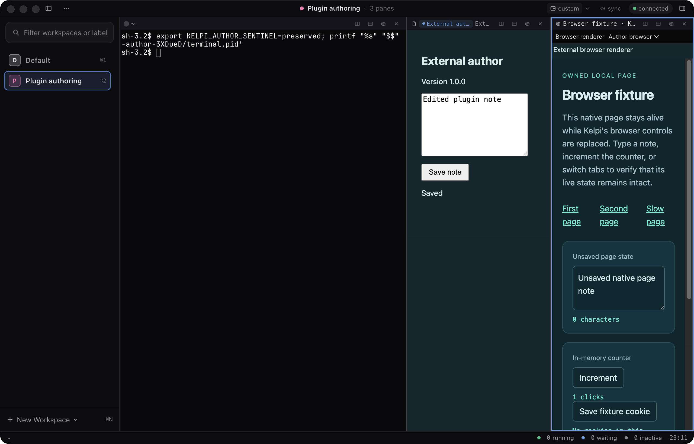
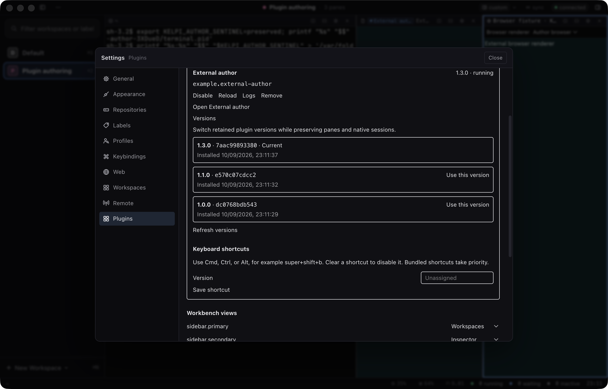
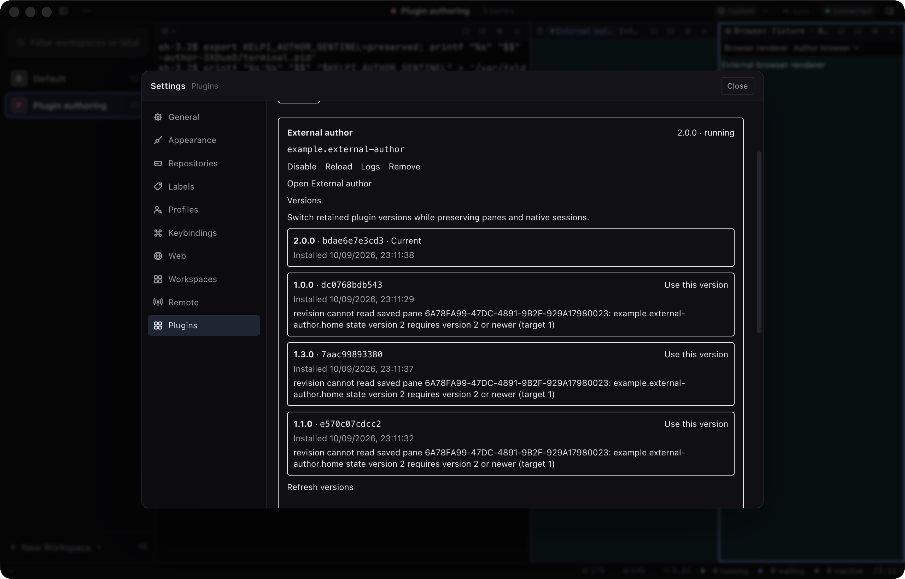

# Plugin authoring validation

This is the pre-review baseline at `fbfe204`, recorded on 2026-09-10. Follow-up fixes
and their validation are recorded in
[Package and recovery review fixes](../../plugin-validation.md#package-and-recovery-review-fixes-2026-09-11).
The [roadmap](../../plugin-roadmap.md) tracks current merged progress and proposed work;
the JSON reports and screenshots here remain tied to the baseline revision.

Validated on macOS arm64 with Node 24.15.0 and pnpm 10.28.1, in the isolated
`out/worktrees/plugin-packaging` checkout based on main `7ba942a`.

The feature layers are `feature/plugin-packaging` → `feature/plugin-revision-recovery` →
`feature/plugin-authoring-workflow`. Each lower layer was exported independently, with its
workspace imports redirected into that export. [Recorded checks](lower-layer-validation.json)
include commands, commits, source hashes and module link targets.

| Check | Result |
| --- | --- |
| Full workspace typechecks and tests | 7,489 root + 868 shell tests pass: **8,357 total**, one existing optional test skipped. |
| Packaging layer `cafd51d` | All typechecks and **828** selected tests pass independently. |
| Recovery layer `ed8d56c` | All typechecks and **933** selected tests pass independently. |
| Hidden private instance | **66/66**: authoring 21, extensions 23, workbench 22. |
| Visible private instance | **66/66** on the same build; all three authoring screenshots inspected. |
| Build verification | All **13** recorded artifact/fixture hashes matched both baseline runs and the outputs used for those runs. |

[Hidden results](hidden/results.json), [visible results](onscreen/results.json),
[build hashes](onscreen/build-manifest.json), [authoring evidence](onscreen/authoring-evidence.json),
[changed source hashes](source-manifest.json), [summary](summary.json).

The authoring scenario creates its project outside the Kelpi repository using the CLI.
It verifies deterministic packaging, installation of the artifact, SDK pane state writes,
stable dev updates, invalid manifests, failed backend activation with storage recovery,
Ctrl-C cleanup, Settings version selection, reload, and incompatible state rollback.
Terminal checkpoints prove both the original OS PID and a retained shell variable. Native
browser checks retain the page's JavaScript identity, unsaved note and counter while each
replacement surface becomes visible. A version that cannot read newer saved state is
refused through both CLI and the disabled Settings control.

The existing extension scenario also exercises commands/hooks, native layouts, provider
selection, shortcut editing and dependency recovery. It explicitly scrolls/focuses its
shortcut control before sending input. The workbench scenario covers sidebar swaps, iframe
isolation, state, view errors, backend restart and bundled fallback.

Hidden screenshots are not used as visual evidence. These runs use separate daemon data,
sockets, ports and Electron profiles. This phase did not rerun the full UI audit, packaged
application smoke, or physical-device tests. Code revision recovery preserves Kelpi-owned
state during a failed update; it cannot undo external effects of trusted plugin code.
