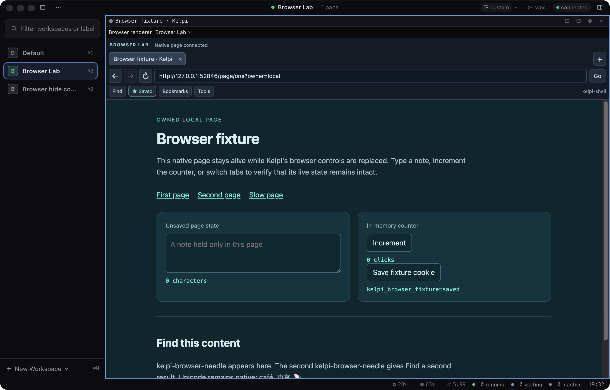
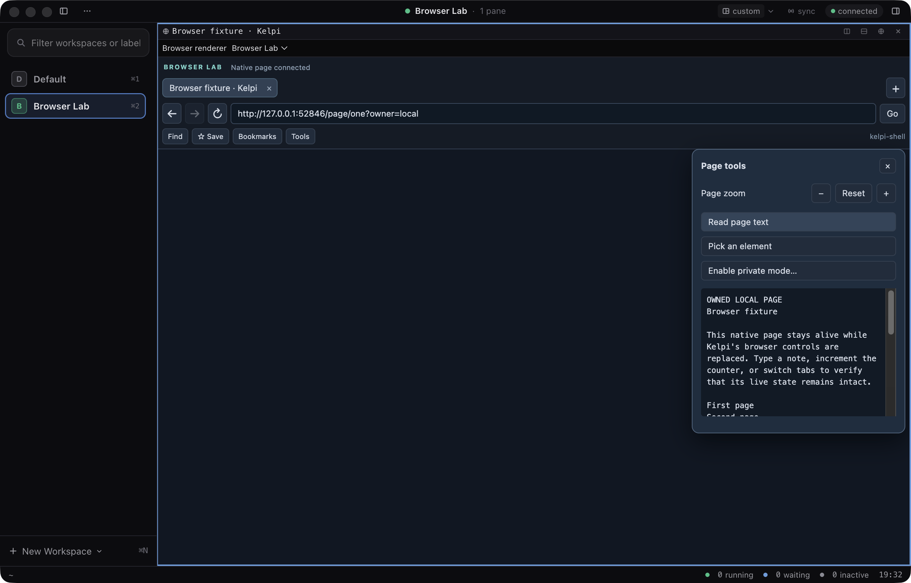
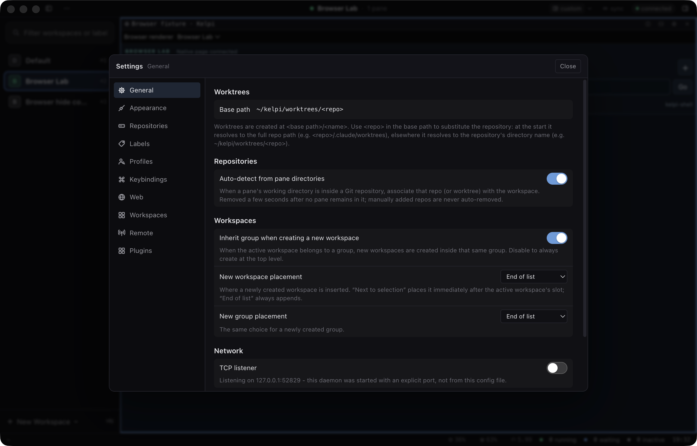
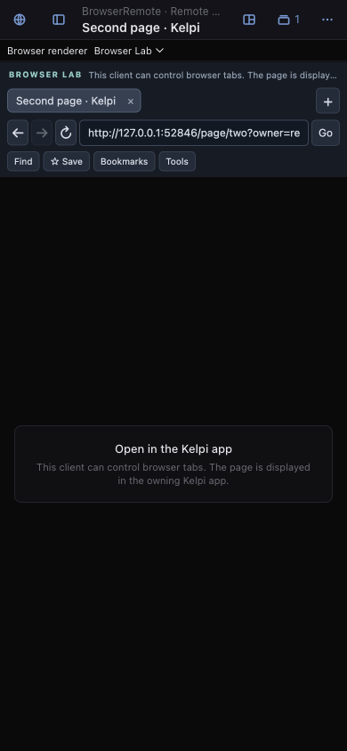

# Browser replacement review record

Validated on 2026-09-10 in the isolated `plugin-browser` worktree, based on merged main
`24b19c9`. The three review layers contain the browser daemon/SDK contract, shared native
page host and replacement UI, then Browser Lab and its live scenario. The
[browser guide](../../plugin-browser.md) describes the API and private-instance installation;
the [validation record](../../plugin-validation.md) records workspace and isolated-layer gates.

The final production build passed **138 live assertions**: Browser Lab 59/59 hidden and
59/59 onscreen, native hide/restore 7/7 and native crash recovery 13/13. All 18 recorded
artifact hashes match across both Browser Lab runs and the final local outputs. These runs
include the final explicit-tab argument guards, inspector invalidation and hook support.

| Evidence | Result |
| --- | --- |
| [Hidden Browser Lab](live-hidden/results.json) | 59/59; [build hashes](live-hidden/build-manifest.json) |
| [Onscreen Browser Lab](live-onscreen/results.json) | 59/59; [build hashes](live-onscreen/build-manifest.json) |
| [Native regressions](native-regressions/results.json) | 20/20 |

The fixture owns its loopback pages and records native CDP target identities, an unsaved
note, a JavaScript counter, cookies and local storage. Assertions cover retained pages
across renderer swaps, plugin/client reload, disable/failure/retry, workspace and zoom
changes; native bounds and popup/modal coverage; real pointer/address/Find interactions;
navigation, tabs, favourites, private-mode confirmation, capture, inspection and batch
updates; remote controls, direct browser/phone availability and native host loss.

The screenshots below are from the final onscreen run and were visually inspected.
Electron's compositor capture includes the native `WebContentsView` in this environment;
the scenario also saves a separate native-page capture in its local raw artifacts.
Hidden-window screenshots are diagnostic only. The desktop controls and focus gutter fit
the live page; both plugin and application overlays park it correctly; the 390px phone UI
fits its viewport and reports that its native page is displayed on the owning desktop.

All daemons, sockets, ports, databases and Electron profiles were private. The harness shut
down after validation. The installed Kelpi and the user's original checkout were preserved.
Raw logs and target/placement diagnostics remain under
`out/plugin-browser-validation/{live-hidden,live-onscreen,native-regressions}`.

Phone coverage uses Chromium emulation. Physical-device software keyboards, OS IME,
packaged-release validation and the full UI audit were not repeated. The existing single
native browser host per daemon remains; this phase supplies remote controls, not remote
page-pixel streaming. Browser Lab demonstrates a subset of the complete shared browser API.
