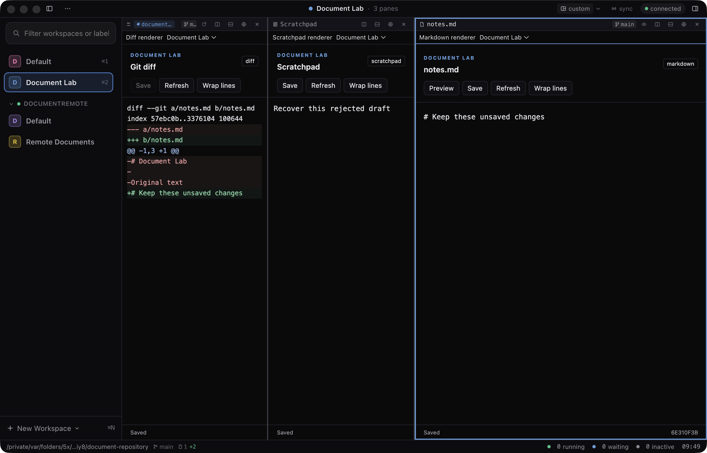
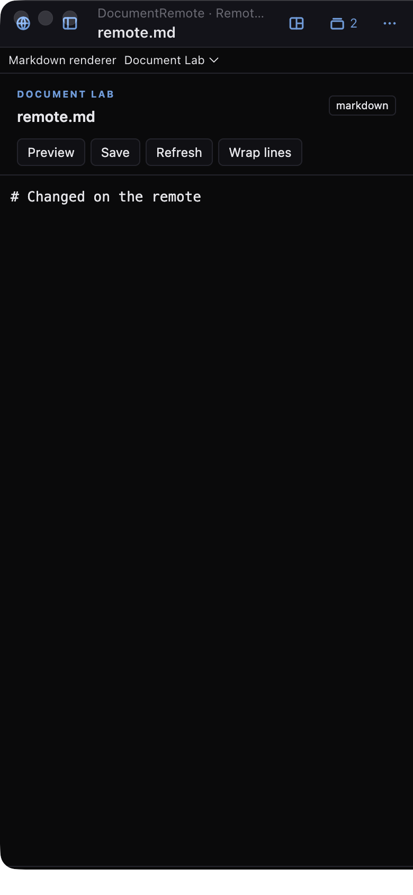

# Document extension validation — 2026-09-10

This is the original phase baseline. The current repository retains this record and the
two screenshots below; the JSON results and logs were local worktree artifacts.
See the [roadmap](../../plugin-roadmap.md#completed-and-merged) for merged phases and
[PR #147](https://github.com/benfriebe/kelpi/pull/147) for the integrated document review.
This record does not claim a fresh run against later review fixes or current main.

Implemented in `out/worktrees/plugin-documents`, based on merged `main` at `b75de68`.
The stack separates shared document APIs, native document feature/recovery integration,
and Document Lab with authoring documentation. The installed application and the unrelated
changes in the primary checkout were not modified.

## Automated checks

| Check | Result |
| --- | --- |
| `pnpm check` | All typechecks passed; 7,029 repository tests passed, one existing skip; 868 shell tests passed. |
| Production bundles | Daemon, client, CLI and shell builds passed. |
| Document scenario, visible instance | 28/28 checks passed; desktop and phone screenshots inspected. |
| Document scenario, hidden instance | 28/28 checks passed, including real pointer and keyboard input. |
| Workbench regression | 22/22 checks passed. |
| Sidebar feature regression | 30/30 checks passed. |
| Chrome feature regression | 34/34 checks passed after establishing initial sidebar visibility. |
| Native preview shortcuts | 6/6 checks passed. |
| Remote plugin regression | 12/12 checks passed. |
| Sidebar swap regression | 11/11 checks passed. |

All live scenarios used the repository harness with private data, sockets, ports, repository
fixtures and Electron profiles. Remote tests started a second private daemon. No real
workspace, installed plugin or user file was used as a mutation fixture. Phone checks used
a 390×844 viewport with touch emulation, not a physical-device session. Local logs and JSON
results were written under `out/plugin-document-validation` in that worktree and are not
included in this repository.

The full suite exposed a pre-existing terminal scroll test timer leak: Ghostty's scrollbar
fade callback outlived a timeout-backed animation-frame shim. The separate test cleanup
commit cancels those timers before restoring globals. The final suite has no unhandled
errors. Browser canvas stubs and shell updater fixtures still emit their expected diagnostics.

The chrome scenario previously assumed the right sidebar started closed. Running it after
the sidebar feature scenario disproved that assumption; its setup now establishes the
starting visibility explicitly. Sidebar → Chrome was rerun together and passed.

The document scenario also waits for a trusted pointer move to reach the child frame before
issuing one real click. Tracing a hidden-window failure showed mouse-up reaching the textarea
without any preceding mouse-down or focus event. Waiting for Chromium's input routing resolved
that harness race; the focus and exact keyboard-text assertions remain in place. The final
hidden and onscreen runs each passed 28/28 in 7.5 seconds. Their results are in
`document-final-hidden` and `document-final-onscreen` under the local validation directory.

## Behaviors exercised

The document scenario installs the SDK-only example and switches all three existing native
document types. It checks source/mode/pane identity, type-specific preferences, real keyboard
input, rapid staged input, autosave, read-only diffs, renderer state, CLI JSON reads/writes/watch,
stale revisions and independent daemon ownership.

Failure checks preserve rejected drafts outside the iframe, refuse unsafe close, fall back
after an uncaught renderer error, reload the window, review the exact recovered text and
restore it through an explicit guarded save. Moving the private repository temporarily
makes a real file save fail; the buffer and pane survive, and restoring the path permits save.
Remote/native/plugin/phone/direct-browser flows are tested, followed by a clean daemon restart
that preserves saved text and invalidates old tokens. Disable/enable preserves native pane IDs
and renderer preferences.

Unit/integration tests additionally cover concurrent edits before autosave, aborted
operations, backend/lease ownership, watch cleanup, malformed and oversized input, rejected
refresh, wrong renderer placement, cancelled activation, pane close/park/reuse/move during
attachment, renderer state/version retention, dirty group cascades including parked documents,
browser storage failure, independent windows and a newer draft arriving during save/close.
An input that matches an older saved snapshot remains recoverable until its own acknowledgement;
an old completion cannot acknowledge a newer draft with identical text.

## Visual review

The desktop view has separate renderer selectors, clear edit/preview controls and readable
source/diff bodies. The phone view fits the available width and uses the same remote document
host. The native macOS window controls visible in the emulated phone capture belong to the
test shell.

## Scope and limits

Document APIs retain native save authority and use 192 KiB JSON-encoded edit and 256 KiB
snapshot/envelope limits. Native views remain available for larger sources. Watches deliver
invalidations/latest snapshots, not an edit replay log; CLI streams have no socket-level
backpressure guarantee. There are at most 128 document subscriptions per daemon.

Browser recovery is scoped to the owning window session. Text never sent to `stage`/`edit`
cannot be recovered from an iframe; other windows and the CLI cannot inspect a window's
unsubmitted draft. Storage failures are shown explicitly. Native editor writes retain their
existing semantics; SDK/CLI writes require revisions. Renderer UI state shares a bounded
256 KiB map per plugin and currently retains closed-pane entries.

Document Lab's Markdown preview intentionally supports only headings, paragraphs and fenced
blocks. This phase extracts document bodies/content ownership, while some native keyboard
actions remained in assembly at that milestone. Terminal/browser replacements and local
plugin packaging/recovery were implemented in later phases; automatic remote updates remain
unimplemented. See the [current roadmap](../../plugin-roadmap.md) for status. No remote CI
result is claimed by this validation record.
