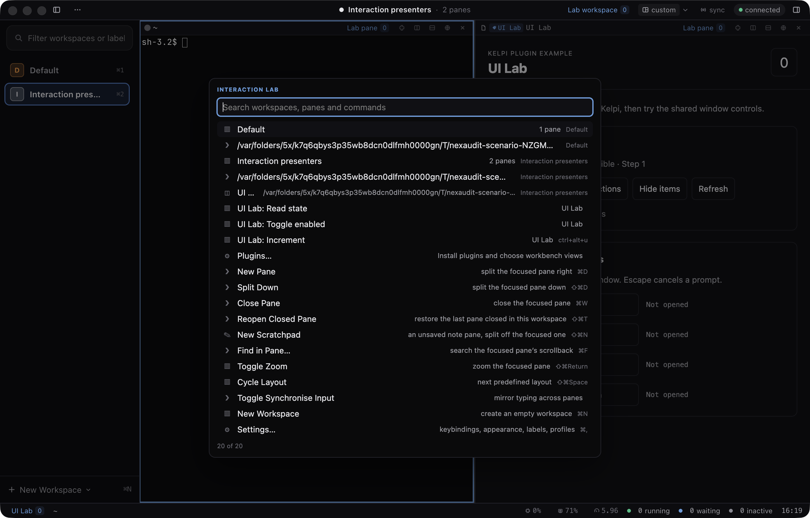
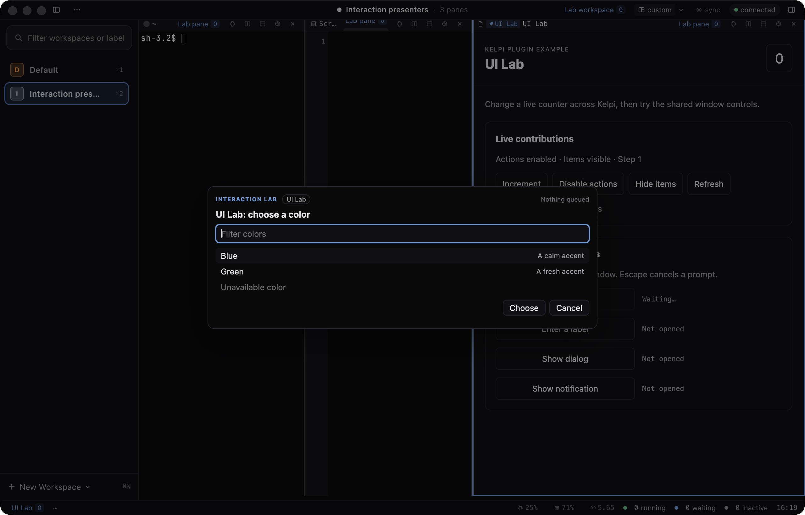
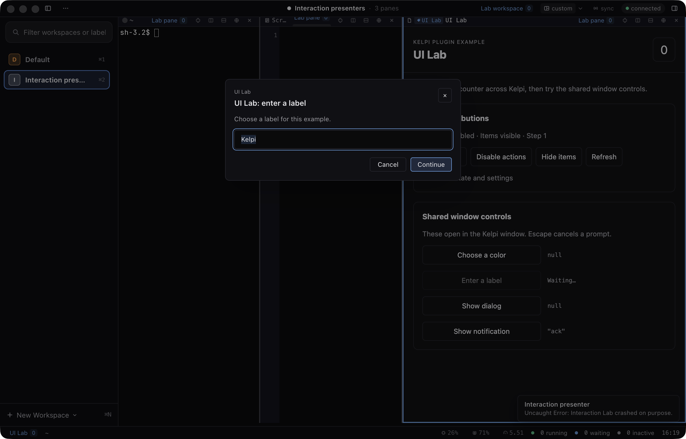
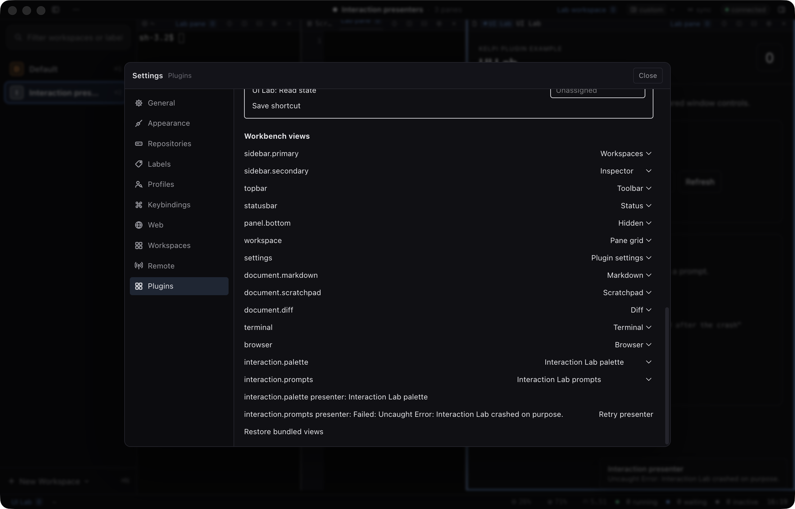

# Interaction presenter validation, 2026-09-12

Retained onscreen evidence for the palette and shared-prompt phase (shared interaction
contracts, selectable presenters, Interaction Lab). The dated
[validation record](../../plugin-validation.md#interaction-lab-and-live-acceptance-2026-09-12)
carries the tested revision, commands and counts. The scenario is
`scripts/scenarios/plugin-interaction-presenters.mjs`; these four screenshots come from its
final onscreen run and were inspected.

Recorded limits: daemon disconnect and reconnect is not pressed by the scenario; phone checks
use emulation; physical devices are not covered. Selectable notification presentation is not
part of this phase.
