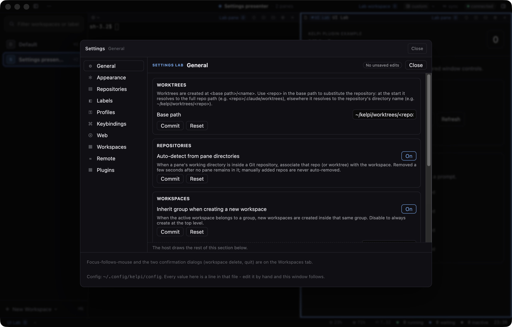
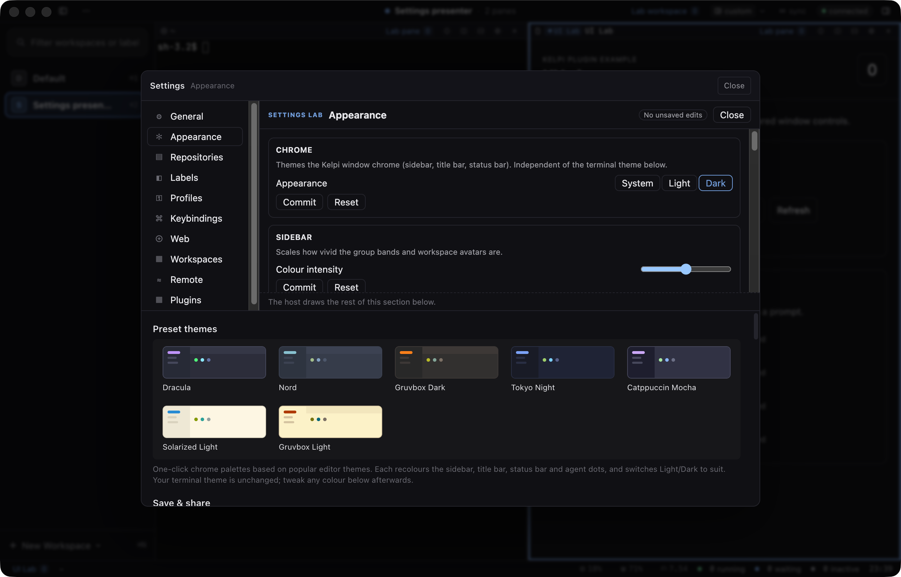
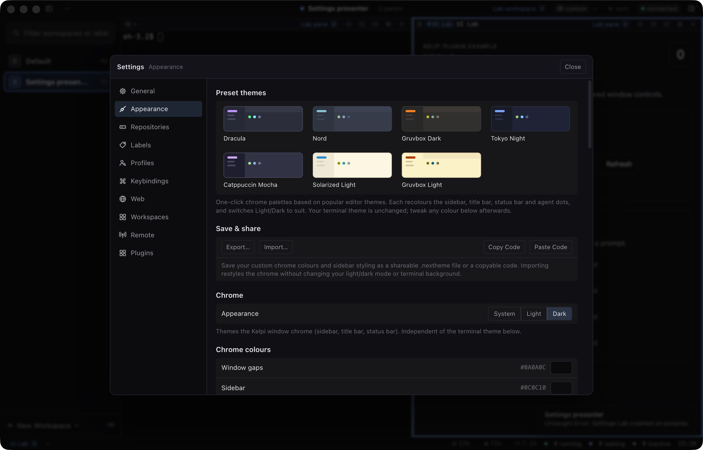
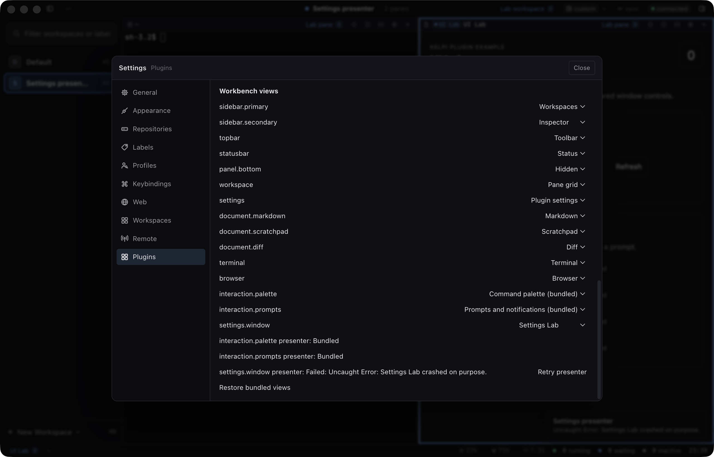

# Settings presenter validation, 2026-09-12

Retained onscreen evidence for the full Settings presentation item (shared settings contracts,
selectable `settings.window` presenter, Settings Lab). The dated
[validation record](../../plugin-validation.md#settings-lab-and-live-acceptance-2026-09-12)
carries the tested revision, commands and counts. The scenario is
`scripts/scenarios/plugin-settings-presenter.mjs`; these four screenshots come from its final
onscreen run and were inspected.

Recorded limits: daemon disconnect and reconnect is not pressed by the scenario; the call
budget breach is covered by unit tests only; phone checks use emulation; physical devices are
not covered.
