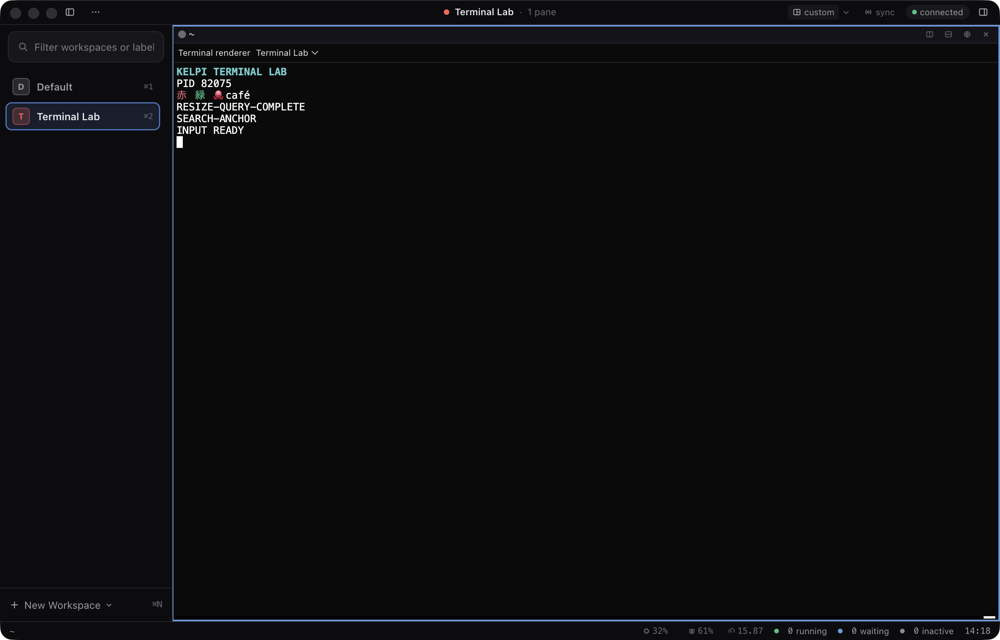
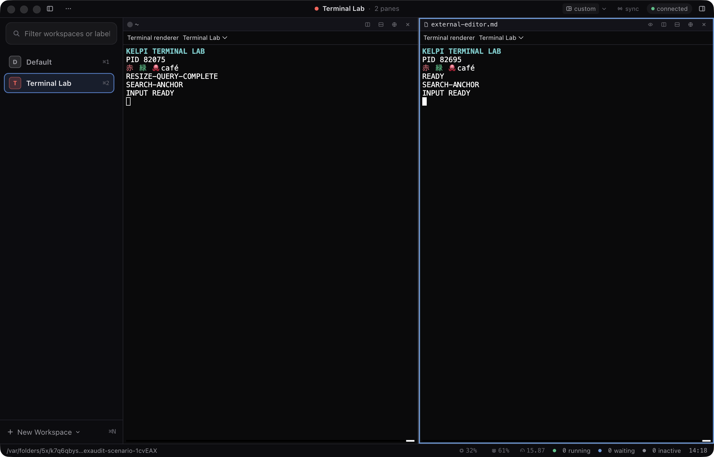
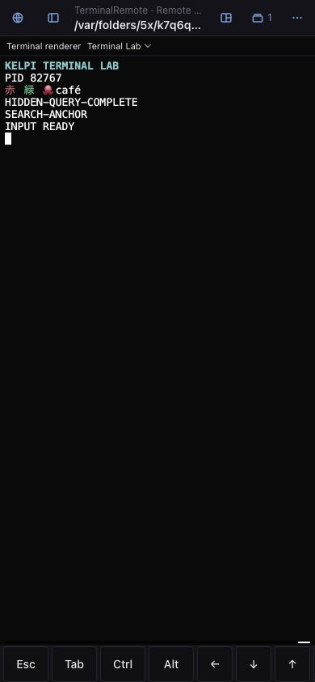
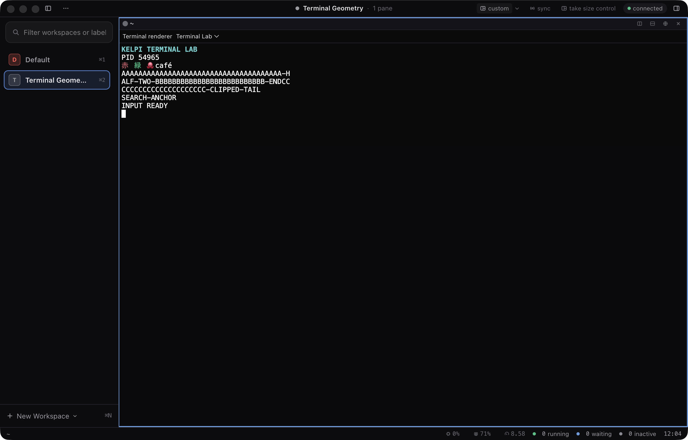
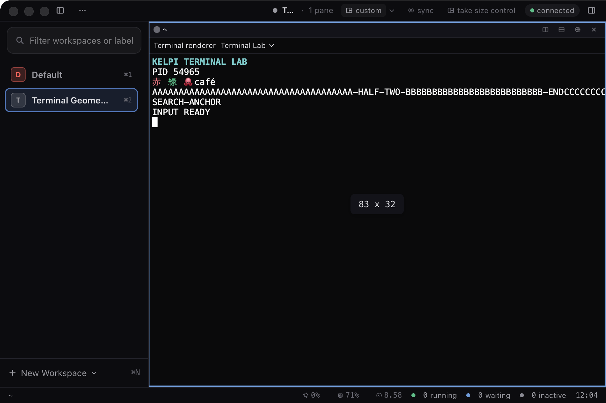
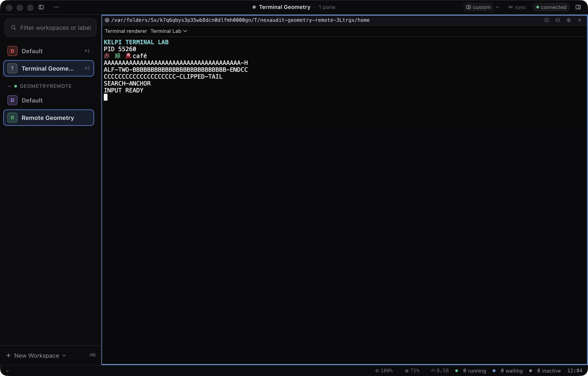

# Terminal extension validation — 2026-09-10

This is the original phase baseline: 8,066 tests and 49 checks in each Terminal Lab run.
The later [terminal review fixes](../../plugin-validation.md#terminal-pr-review-fixes-2026-09-10)
record additional changes and checks. See the [roadmap](../../plugin-roadmap.md) for current
merged status.

Implemented in `out/worktrees/plugin-terminals`, based on merged main `021e193`.
The stack separates the public terminal session contract, native feature integration,
and Terminal Lab with authoring documentation. Testing used private daemons, state,
sockets, ports, owned repository fixtures and Electron profiles.

| Gate | Result |
| --- | --- |
| Complete `pnpm check` | All typechecks pass; 7,198 root and 868 shell tests pass (8,066 total), with one existing optional database skip. |
| Contract PR in isolation | All typechecks and 247 focused tests pass. |
| Feature PR in isolation | All typechecks and 35 focused integration tests pass without the example; its 20 UI files match the validated export. |
| Production builds | Daemon, CLI, client and shell outputs build successfully; cached outputs are checked against source hashes. Terminal Lab builds from pinned local dependencies. |
| Terminal Lab, hidden instance | 49/49 checks pass in 20.4 seconds. |
| Terminal Lab, onscreen instance | 49/49 checks pass in 15.5 seconds; all three screenshots inspected. |
| Existing native scenarios | 48/48 checks pass: workspace focus 14, platform shortcuts 20, Copy/Paste 14. |

The two final Terminal Lab runs used identical SHA-256 manifests for all 14 recorded
artifacts. Including existing native regressions, 146 live assertions passed at this baseline.
Only this README and the three screenshots below are retained in the repository. Full logs
were written under `out/plugin-terminals-validation`; the original untracked results,
manifests and diagnostics used `docs/audit/plugin-terminals/live-hidden` and `live-onscreen`
in that worktree. Earlier failing iterations used its local `attempts` folder. Those local
artifacts are not included here; the counts above are the preserved narrative record.

The scenario compares a real emulator's ANSI/Unicode viewport with the daemon's screen,
uses actual keyboard, composition, mouse and clipboard input, and checks operating-system
PID continuity across switches, fallback, reload, reconnect, zoom and workspace navigation.
Each main fixture emits 12,607,488 bytes across normal, slow-consumer and renderer-handoff
bursts and recovers through two flow-control resyncs. A delayed live parser query still
receives its response after a replacement replay; protocol replies and mouse input do not
leak to synchronized sibling processes.

It also checks live search/repeated reveals, external-editor save/return, remote clipboard
ownership, retained hidden sessions, phone Ctrl latch clearing, and PTY geometry ownership.
A second protocol client owns geometry before the real window reclaims it through the
native Take Size Control action. Local workspace/zoom eviction and remote phone layout
changes retain their existing detach/reattach behavior and the same process.

## Visual review

The desktop terminal and document's external editor retain native pane headers and expose
the terminal renderer selector. The emulated remote phone uses matching dark terminal
padding and shows the complete key bar inside its visible viewport. Its screenshot uses
the Chromium surface because the emulated viewport is taller than the audit's native
window; a separate DOM assertion checks that the controls fit. Hidden screenshots are
not used as visual evidence.

## Replay geometry and size ownership (2026-09-12)

The SDK geometry parity phase on `feature/plugin-terminal-geometry` added
`scripts/scenarios/plugin-terminal-geometry.mjs`, which re-runs the bundled
`terminal-mirrors-owner-grid` shape against Terminal Lab through the public contract only.
Its onscreen screenshots were inspected; three are retained here with the daemon capture
the letterboxed screen was compared against. The dated
[validation record](../../plugin-validation.md#terminal-sdk-geometry-parity-2026-09-12)
carries the exact revision, commands and counts.

`geometry-owner-width-capture.txt` is `kelpi pane capture` of the same pane at the owner's
width, which the letterboxed screenshot must match row for row.

## Limits

Phone checks use a 390×844 viewport with touch emulation. Physical mobile keyboards,
OS IME candidate windows and two simultaneous native windows remain manual checks.
The terminal/daemon suites additionally cover window size policy. Packaged-release
validation and the complete UI audit were not repeated for this phase.

Terminal Lab uses a pinned xterm adapter, including documented private xterm seams.
It retains Kitty mode metadata without implementing Kelpi's custom Kitty encoder;
unsupported UTF-8 and urxvt mouse encodings disable mouse reporting. These example
limitations do not restrict another renderer's implementation of the public contract.
See the [terminal guide](../../plugin-terminals.md) for authoring and private-instance
installation instructions.
