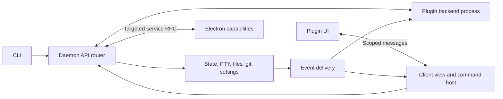

# Kelpi plugin extensibility audit

Audited 2026-09-08, starting at `2262828` and reviewing relevant intervening changes through
`3233e4b`. This is the **historical source audit and design proposal**, not a description
of the current repository. Source observations, line numbers and proposed APIs below refer to
that audit. They are retained to explain the decisions; current implementation takes
precedence where it differs.

The [roadmap and progress tracker](plugin-roadmap.md) is the current overall plan, last
reviewed against merged main `ab9be92` on 2026-09-12. The [plugin guide](plugins.md) defines
the implemented API, installation and recovery; the [validation record](plugin-validation.md)
tracks completed phases and their evidence.

The subsequent [feature](plugin-features.md), [chrome](plugin-chrome.md),
[document](plugin-documents.md), [terminal](plugin-terminals.md) and
[browser](plugin-browser.md) guides describe the implemented replacement contracts.
Local package distribution, version history/rollback, failed-update recovery, templates and
live development are also implemented; see the [development guide](plugin-development.md).
The [handoff](plugin-handoff.md) recommends closing the terminal SDK replay-geometry gap,
then implementing selectable palette/prompt presentation. Public SDK releases,
automatic remote distribution and an untrusted runtime remain follow-up work.

**Recommendation.** Build a small application kernel with bundled feature plugins and
installable plugins. Make the workspace sidebar, inspector, pane bodies, menus, and status
items consume the same contribution contracts available to plugin authors. Keep the daemon
authoritative for sessions and product state. Give plugins a versioned SDK covering commands,
queries, events, services, and UI composition across daemon and client boundaries.

Kelpi has enough useful boundaries to introduce this incrementally. The work is broader than
loading custom React components: persistence, command routing, focus, remote execution,
plugin lifetime, and compatibility are equally necessary parts.

Rollout assumption: explicitly installed, trusted plugins first. UI containment can still
be present in that release. An unrestricted Node backend is fully trusted code on the daemon
machine; its capability declarations cannot constitute an OS security boundary. Supporting
untrusted backend plugins would be a separate runtime milestone.

## Repository state at the original audit

| Area | Evidence | Implication |
| --- | --- | --- |
| Package boundaries | `packages/{core,protocol,daemon,client,cli,shell}`; [architecture](../ARCHITECTURE.md) | Domain logic, transport, UI, and native integration already have distinct homes. Preserve them. |
| Generic layout | [layout types](../packages/core/src/layout/types.ts), [grid rendering contract](../packages/client/src/grid/types.ts), [PaneGrid](../packages/client/src/grid/PaneGrid.tsx) | Layout leaves contain pane IDs. `renderPane` and `renderPaneOverlay` are good insertion points. Layout algorithms need no per-plugin branch. |
| Fixed pane identities | [core pane types](../packages/core/src/layout/pane.ts), [wire vocabulary](../packages/protocol/src/wire/vocab.ts), [agent pane kinds](../packages/core/src/agent/types.ts) | The five built-in kinds are repeated across layers. A plugin must not require adding another string to these lists. |
| Fixed UI assembly | [App](../packages/client/src/App.tsx), especially `renderPane` at line 4033 and chrome assembly from line 4258 | The 5,187-line component selects each pane renderer and directly mounts Sidebar, Inspector, TopBar, and StatusFooter. Runtime registration alone would leave most UI inaccessible. |
| Usable component boundaries | [Sidebar props](../packages/client/src/chrome/Sidebar.tsx), [grid props](../packages/client/src/grid/types.ts), [settings props](../packages/client/src/settings/types.ts) | Many components already accept models/callbacks. Wrap them in feature adapters before changing their internals. |
| Shared command dispatch, with gaps | [dispatcher](../packages/daemon/src/boot/dispatch.ts), [composition](../packages/daemon/src/boot/compose.ts), [WS routing](../packages/daemon/src/ws/sync.ts) | Control handlers use a merged map, but content, settings, search, desktop, and other operations also have separate WS routes. There is no complete transport-independent product API yet. |
| Closed CLI protocol | [decoder](../packages/protocol/src/wire/decode.ts), [reply allowlist](../packages/protocol/src/allowlist.ts), [CLI dispatch](../packages/cli/src/cli.ts) | Unknown verbs are rejected before dispatch. Reply/stream behavior and CLI commands are also fixed. Adding a handler map entry is insufficient. |
| State and events | [store](../packages/daemon/src/store/store.ts), [event types](../packages/daemon/src/store/types.ts), [WS delta broadcast](../packages/daemon/src/ws/sync.ts) | Ordered state changes and subscriptions exist. Subscriptions execute synchronously, and the public-facing deltas represent replication rather than a complete semantic hook API. |
| Private client coupling | [client store](../packages/client/src/state/store.ts), [runtime](../packages/client/src/state/bridge.ts) | The client imports daemon store types and event replay. Useful internally, but publishing this as the plugin SDK would freeze implementation details. Unknown delta kinds are dropped. |
| Existing isolated HTML UI | [ContentFrame](../packages/client/src/content/ContentFrame.tsx), [content bridge](../packages/client/src/content/bridge.ts) | Markdown/diff use an `allow-scripts` iframe, a CSP allowing the host bridge script, and messages for focus, keys, copy, and links. Reuse the experience and host responsibilities; create a dedicated plugin bridge. |
| Existing native service RPC | [web host channel](../packages/daemon/src/webpane/host.ts), [shell security configuration](../packages/shell/src/main.ts) | The daemon already forwards bounded calls to Electron. The current host registry is specifically a single web-pane host, not a general plugin host registry. The shell has no preload. |
| Closed commands/settings UI | [actions](../packages/core/src/config/actions.ts), [binding parser](../packages/core/src/config/bindings.ts), [settings catalog](../packages/client/src/settings/catalog.ts), [palette](../packages/client/src/chrome/palette.ts) | Plugin actions must participate in binding parsing, palette entries, menus, help, and settings; registering pane bodies alone misses these surfaces. |
| Remote clients | [remote runtimes](../packages/client/src/app/remote-daemons.ts), [RemoteWorkspaceView](../packages/client/src/app/RemoteWorkspaceView.tsx) | One client can connect to several daemons. The secondary-daemon renderer currently supports terminals and gives other kinds placeholders. This path needs the same plugin view resolver as the primary workspace. |
| Packaging | [daemon bundle](../packages/daemon/scripts/bundle.mjs), [HTTP serving](../packages/daemon/src/ws/http.ts), [package definitions](../package.json) | Internal packages export TS source and are bundled into the product. Installable plugins need prebuilt artifacts, an actual distributable SDK, and asset loading outside the app bundle. |

## Persistence is the first correctness barrier

`decodePaneType` in [db/codec.ts](../packages/daemon/src/db/codec.ts), line 220, maps an
unrecognized type to `shell`. [Boot restoration](../packages/daemon/src/boot/resume.ts),
line 155, selects shell panes for PTY spawning. A new custom type written today could therefore
restore as a terminal. A disabled or missing plugin must instead preserve the pane and its
data, render an unavailable view, and spawn no substitute process.

There is a second trap: [writeSnapshot](../packages/daemon/src/db/persistence.ts), line 340,
deletes and reinserts pane/workspace rows on each save. A plugin side table with a cascading
foreign key to `pane` could lose data on an ordinary save. Extra pane columns also disappear
unless every snapshot, codec, and explicit INSERT path carries them. Plugin persistence needs
to be designed with this transaction model, including close/reopen and workspace deletion.

For the first implementation, add one durable `plugin` pane category and a namespaced
descriptor, rather than one category per extension:

```ts
// Proposed public identity stored with a plugin pane.
interface PluginPaneDescriptor {
  pluginID: string;       // "example.agent-board"
  viewID: string;         // "example.agent-board.board"
  stateVersion: number;
  state: JsonObject;      // Small, non-secret, shared view/document state.
}
```

Keep built-in wire names such as `shell` compatible and map them to registered view
definitions. Store the descriptor through the complete pane snapshot/restore path. Keep
larger/private plugin data in host-managed namespaced storage with explicit cleanup, outside
the existing clear-and-reinsert tables. A separate plugin database is a reasonable first
implementation; define recovery for a crash between pane creation and private-state writes.
New readers must preserve unsupported records without converting their identity.

Older binaries remain a problem even after fixing new readers: they still interpret
`plugin` as `shell`, and they do not automatically honor a newly invented minimum-reader
marker. Before persisting plugin panes, establish a supported downgrade policy. The robust
option is a new database generation/path with a consistent one-time migration and backup;
old binaries retain their old file. A marker alone cannot make already shipped code safe.
If retaining the same path, every supported reader/launcher must enforce compatibility
before plugin records can be written, and older unsupported readers must be excluded.

## A view definition and its placement should be separate

A pane is a workspace-owned instance in the existing layout tree. A sidebar is a container
in a client's application layout. Both can host registered views, but their ownership and
lifetimes differ. Do not store the workspace sidebar as a synthetic terminal pane.

The application host should provide these composition points:

| Contribution | Example | Contract |
| --- | --- | --- |
| View definitions | Agent board, file browser, issue list, workspace tree | Namespaced ID, renderer adapter, supported placements, instance scope, state schema, lifecycle. |
| View containers | Primary/secondary sidebar, bottom panel, pane area | Accept registered views; retain user placement, visibility, sizing, and ordering choices. |
| Container providers | Replacement primary sidebar or application layout | Explicit user-selected provider with a bundled fallback; do not let load order select a winner. |
| Pane chrome | Header badges, toolbar actions, custom header body, overlays | Host retains focus/drag/resize/close routing and accessibility boundaries; plugins can supply presentation within them. |
| Menus and commands | Pane menu, workspace menu, top bar, palette, shortcuts | Common command IDs, argument schema, enablement/context conditions, and ordering. |
| Settings and appearance | Plugin settings, themes, icons | Namespaced schemas, generated standard controls, optional custom settings views, documented design tokens. |
| UI service providers | Navigation UI, notification presentation, quick pick/search | Replaceable presentation through stable interfaces so other plugins do not import a specific sidebar. |

Register `kelpi.workspaces`, `kelpi.inspector`, and built-in pane views through these contracts.
The default workbench layout becomes a saved composition of bundled contributions. Container
providers can introduce further named slots, so extensibility can grow beyond a fixed list
of left/right/bottom areas. Required providers must resolve before dependent plugins activate;
missing optional providers disable only the corresponding contribution. Reject dependency
cycles and duplicate IDs with an actionable diagnostic.

Keep startup, service routing, persistence, window attachment, and recovery in the small
kernel. A recovery command and safe-mode launch must remain reachable even if a replacement
sidebar or workbench provider fails. The terminal engine can remain a privileged built-in
service while its UI and commands use the same contribution contracts.

## Use separate execution locations, connected by one SDK



The backend runs beside the daemon, once per activated plugin per daemon, and survives UI
detachment. Start with a supervised child process for each active backend plugin. This
contains ordinary crashes and event-loop stalls and gives reload/disable a clear lifecycle.
Resource exhaustion still needs budgets and diagnostics; a process boundary is not unlimited
resource protection. Avoid arbitrary plugin callbacks inside the daemon store's synchronous
notification loop.

Plugin views run in the viewing client, once per view instance. Default external arbitrary
HTML/JS views to a dedicated iframe host; authors can use React, Svelte, plain JS, or other web
frameworks inside it. Render small declarative contributions such as tree rows, menu entries,
and status items with Kelpi components so every badge does not need its own iframe. Built-ins
use a native React adapter. An optional external native adapter must be explicitly full trust
and version constrained: it shares the app's JS environment, so it cannot promise isolation
or the same framework-version independence as a frame.

Separate optional browser background logic from visible views when needed. Headless work
must not live in a React mount effect. Native integration goes through named Electron
services and an explicit window target; installing a plugin should not require loading its
code into Electron's main process. The existing web host provides useful timeout/reconnect
patterns, but its single-host ownership should not be copied into multi-plugin registration.

Every SDK context carries an explicit `daemonID`, with `workspaceID`, `paneID`, `clientID`,
and `windowID` where applicable. Paths and processes belong to the target daemon. Clipboard,
dialogs, focus, and notification presentation belong to a viewing device/window. Calls with
no compatible target return a structured unavailable result. A CLI command must not silently
run once in every attached window, and a sidebar showing several daemons needs separately
authorized handles to each.

## Expose all product domains through services, commands, queries, and events

| Domain | Proposed plugin access | Semantics to preserve |
| --- | --- | --- |
| Workspaces/groups/layout | List/watch/create/update/reorder, split/move/close/focus, labels and selection context | Validate via domain operations; retain delete guards and distinguish canonical focus from per-client UI selection. |
| Panes | Register/open/restore views; metadata, lifecycle, title/badges, close/reopen | Pane IDs and resources survive layout moves. Hidden, unmounted, closed, and backend-deactivated are different events. |
| Terminals/processes | Capture/search, output subscription, send input/keys, create managed processes | Explicit input authority, replay/gap information, and stream backpressure. Observing output must not claim PTY size control. |
| Agents | Lifecycle/status/session queries and events, restart/resume operations | Preserve session ownership and daemon lifecycle; map semantic events from the existing state machine. |
| Files/content | Scoped read/write/watch, document openers, content/editor providers | Execute on the daemon; validate paths and conflicts, and distinguish pending saves from durable writes. |
| Git/repos/worktrees/graft | Status subscriptions and service operations | Reuse current services and operation guards; avoid duplicating git orchestration inside every UI. |
| Settings | Namespaced settings schemas, reads/updates/change events | Plugin defaults, user/workspace overrides, validation, and a durable settings format. Secrets have separate storage. |
| Application UI | Views, containers, actions, menus, palette, dialogs, focus, theme, status items | Context-sensitive command routing and consistent keyboard/phone behavior. |
| Desktop/browser host | Clipboard, file picker, reveal/open, notifications, optional browser automation | Explicit host capabilities; Electron-only functionality reports unavailable in browser/headless configurations. |
| Plugin interoperability | Versioned provided/required services, plugin commands and events | Namespaced ownership, declared dependencies, caller identity, and no permission escalation through another plugin. |
| Daemon/plugin administration | Health, plugin management, reload, logs, installation and capability discovery | Administrative access is explicit; plugin code must not receive the daemon owner token to obtain its ordinary API access. |

Extract a shared command router under the existing wire and WS adapters. Each command should
declare its ID, execution location, validated input/output, required capabilities, context
conditions, cancellation/deadline behavior, and optional UI/CLI metadata. Keep legacy CLI
verbs as compatibility adapters, including their fire-and-forget behavior and existing
policy differences. In particular, do not accidentally give every caller the GUI-specific
last-workspace deletion behavior while unifying transport.

Add a small set of known wire envelopes such as `plugin-call`, `plugin-list`, and
`plugin-subscribe`. Their nested method/event IDs can be extensible while the old top-level
decoder and reply framing remain explicit. Implement those envelopes through decode, field
validation, reply allowlisting, dispatch, and streaming cleanup together. Use the same method
registry from WebSocket calls and generate plugin help/schema discovery from its metadata.
UI-local commands can execute locally; external calls need a targeted request/reply relay.

Proposed usage, rather than new executable code inside every CLI installation:

```sh
kelpi plugin create agent-board
kelpi plugin install ./agent-board
kelpi plugin list --json
kelpi plugin run example.agent-board.open --input '{"workspaceID":"..."}' --json
kelpi plugin watch example.agent-board.activity --json
kelpi plugin logs example.agent-board
kelpi plugin reload example.agent-board
```

Successful registration makes a command available to the CLI, UI SDK, keybindings, and
palette where its declared execution context supports them. UI callers should not spawn
the CLI executable to obtain daemon functionality. Expose built-in operations through typed
SDK wrappers over the shared services. Publish transport-neutral data types without imports
from daemon internals or a writable Zustand store.

For hooks, support three distinct contracts: notifications after a state change or command
completion; providers selected to supply a result; and explicitly supported pre-operation
hooks. Deliver notifications asynchronously through bounded queues with daemon epoch,
sequence/cursor, origin, and correlation IDs. Subscribe with a snapshot/cursor barrier so
events cannot be lost between initial query and watch. Reconnect reports gaps and resyncs;
it must not imply that ephemeral events were durably replayed.

Pre-operation hooks need documented ordering, deadlines, and per-operation timeout policy.
Do not run arbitrary async plugin code inside a reducer/DB transaction. Revalidate relevant
state after a hook finishes, before applying the operation. Prevent recursive command/event
loops, and never let an optional plugin indefinitely delay terminal output, state replication,
session restore, or daemon shutdown. Background automations requiring durable delivery need
an explicit job/event log with retries and idempotency; the current delta stream is not one.

This gives plugins access across Kelpi's product surface without promising a stable hook at
every private function. New extension needs should become documented service/provider APIs;
an experimental API can be explicitly tied to a compatible Kelpi build while it matures.

## Plugin identity, distribution, and authority

Use a manifest that can be read without executing plugin code. An illustrative shape:

```json
{
  "id": "example.agent-board",
  "version": "0.1.0",
  "apiVersion": "1",
  "entrypoints": {
    "daemon": "dist/daemon.js",
    "views": "dist/ui/index.html"
  },
  "capabilities": ["workspaces.read", "agents.read", "panes.create"],
  "contributes": {
    "views": [{
      "id": "example.agent-board.board",
      "title": "Agent Board",
      "placements": ["pane", "sidebar.secondary"],
      "stateVersion": 1
    }],
    "commands": [{
      "id": "example.agent-board.open",
      "title": "Open Agent Board",
      "location": "daemon"
    }]
  }
}
```

The full schema also needs activation conditions, dependency/API requirements, context and
argument schemas, platform support, and the trust/runtime mode. Contributions remain
discoverable before lazy activation. Publish a small `@kelpi/plugin-api` contract package,
an SDK with browser/daemon adapters, an optional UI component library, and a build/template
tool. Plugins ship compiled UI and backend bundles; users should not rebuild Kelpi or need
the monorepo's source-exporting internal packages.

Keep installations in the daemon's per-user data area, separate from packaged resources.
Initially support local development directories and prebuilt archives. Store exact package
version/hash, enabled state, and declared/granted access. Stage and validate installation,
then activate atomically. UI and backend from one plugin version must stay paired, including
across reconnect/update; retain old assets until their views close or reload coherently.
Reload a plugin without restarting the daemon or unrelated PTYs. Registry publication and
removal must be atomic so clients never see half a plugin.

Serve plugin assets through a dedicated loader/route with containment and symlink checks,
versioned paths, correct content types, scoped access, and clear 404s. The existing SPA
catch-all must not answer a missing plugin script with the app's HTML. Never execute uploaded
plugin HTML as a top-level same-origin application page: isolation must also hold if an asset
URL is opened directly. Design response CSP/sandboxing and permitted script/resource fetches
alongside the iframe loader. Keep plugin assets and credentials out of the application service
worker's accidental cache/fallback paths. The current content-pane bridge and pane-asset
responses already enforce CSPs; plugin scripts require their own deliberate loading policy,
not weakening the preview policy. Remote UI delivery must fetch from the owning daemon
without leaking that daemon's token to the frame or another daemon.

The plugin bridge should bind a fresh instance/generation to the exact frame and a dedicated
message port after a validated handshake. An opaque iframe origin is not itself an identity.
Use runtime schemas, bounded payloads, method authorization, and teardown/revocation; do not
authorize calls using a plugin ID supplied in message JSON. Have the trusted host attach the
authenticated caller context, and authorize at the daemon/service boundary as well as the UI
broker. Nested calls cannot acquire another plugin's broader permissions automatically.

Existing token/device authentication is useful transport infrastructure, but it does not
provide per-plugin method or resource permissions. Separate plugin settings/private storage
from view state: [serializePane](../packages/daemon/src/ws/serialize.ts) currently spreads
pane fields to clients, so adding a generic object there must not expose backend credentials.

For a future restricted runtime, enforce capabilities on reads and subscriptions as well as
writes, including workspace scope, filesystem roots, process execution, network destinations,
PTY input, and native services. Process/terminal execution grants can effectively confer host
control and should be represented honestly. A Node child process can bypass SDK checks via OS
access; a restricted backend requires an actually constrained runtime and brokered I/O.
Node's own documentation explicitly excludes `node:vm` as a security mechanism.
[Node VM documentation](https://nodejs.org/api/vm.html).

## Lifetime and UI integration are part of the API

The host owns stable instance identity, frame/size updates, theme tokens, accessibility name,
focus requests, clipboard/menu routing, and keyboard context. Each view receives explicit
mount, visibility, focus, restore, and dispose signals. Closing an editor supports a bounded
save/dirty-state flow; losing a renderer must not silently destroy its durable document.
Adapt the existing [pane focus behavior](../packages/client/src/app/pane-focus.ts), including
the phone's explicit keyboard policy, rather than exposing arbitrary `element.focus()` calls.

Preserve the grid's stable keyed pane bodies during splits/moves and distinguish hidden
zoomed panes from destroyed views. A sidebar-to-pane move may cross DOM hosts and remount;
define snapshot/restore for that transition instead of implying React preserves arbitrary
parent changes. The SDK should make this ordinary for plugin authors.

Every subscription, timer, process lease, stream, and registration belongs to a disposable
activation or view scope. Failures show an isolated error view and diagnostics with the plugin
ID; disable leaves recoverable placeholders and saved layout intact. Deactivation cancels
pending calls and disposes registrations. Distinguish persistent daemon-owned resources from
plugin-owned temporary processes so reloading a plugin does not kill user sessions. Bound
activation/restart attempts and provide a safe-mode startup that loads bundled recovery UI.

## Original implementation sequence and proof of completion

This was the proposed sequence at the audit. The [current roadmap](plugin-roadmap.md)
maps delivered work to merged PRs and identifies remaining UI and distribution work;
the table below is not a live checklist.

| Stage | Concrete change | Evidence required before proceeding |
| --- | --- | --- |
| 1. Prove UI composition with built-ins | Add view/container registries and a workbench host. Register the existing workspace sidebar and scratchpad renderer through adapters. Extract their assembly from App; keep existing layout and domain behavior. | Both render through registration; the sidebar provider can be replaced in a fixture; existing focus, drag, shortcut, and phone behavior passes relevant checks. |
| 2. Establish the shared API | Introduce versioned data contracts, command/service metadata and router; adapt a built-in command plus WS-only operations needed by the example. Add generic CLI envelopes, discovery, and scoped event subscriptions. | The same operation works through CLI and UI with consistent validation/policy; legacy decoder/CLI compatibility tests still pass. |
| 3. Ship one complete plugin | Add local installation, manifest discovery, supervised backend, iframe/declarative UI host, plugin pane persistence, and missing-plugin recovery. Build the agent-board example above. | Install without rebuilding Kelpi; open by CLI and palette; live agent updates; restore after restart; run background logic with no UI; disable/re-enable without losing pane state. Include the database generation/downgrade decision here. |
| 4. Complete the intended UI surface | Migrate Inspector, other pane adapters, menus, status/footer, settings/keybinding catalog, and navigation presentation to contributions. Add container placement/provider customization and remote-runtime resolution. | A plugin can replace the sidebar and add views/actions/settings without editing App. The same supported view works in Electron, a direct browser/phone attachment, and a secondary-daemon workspace. |
| 5. Broaden service coverage and harden distribution | Extend typed service coverage to the capability table, explicit provider/pre-operation hooks, inter-plugin dependencies, upgrades/rollback, and diagnostics. Add a restricted runtime if untrusted third-party support is required. | Crash/timeout/permission/reconnect/upgrade failures are isolated and observable. Restricted access claims are tested at actual runtime boundaries before being offered to users. |

The first complete vertical slice should be an **agent board available both as a pane and a
sidebar view**, opened from either CLI or palette, watching agent lifecycle events, and able
to create/focus panes through the SDK. Its backend also records a bounded activity history
while all windows are closed. This exercises the user's intended daemon/CLI/UI reach and
proves that the same view is reusable in different placements.

Important implementation verification includes persistence round trips and ordinary-save
side-table survival; unavailable-plugin recovery without PTY spawning; command framing and
stream disposal; plugin crash/slow consumer behavior; concurrent clients and daemon identity;
focus/keyboard/drag/zoom with real embedded views; instance spoofing/revocation; and matching
UI/backend versions during update. Reuse existing targeted suites and live smokes, then run
the repository's required checks for the actual implementation diff. No timing estimates are
asserted here: the first built-in extraction and complete plugin slice should establish them.

## Architectural precedents and choices

JupyterLab demonstrates the closest composition model: nearly all application features,
including menus/status UI, are extensions, with explicit service providers/consumers that
allow implementations to be swapped. Kelpi can adopt that principle while retaining its
current React components and ID-based pane grid.
[JupyterLab extension development](https://jupyterlab.readthedocs.io/en/stable/extension/extension_dev.html).

VS Code demonstrates separation of local/browser/remote extension execution, declarative
contributions, and arbitrary HTML UI communicating over messages. Those patterns are useful
for Kelpi's daemon/browser/Electron split; implementing a VS Code-compatible extension runtime
would be a much larger and unnecessary commitment for the requested feature.
[Extension hosts](https://code.visualstudio.com/api/advanced-topics/extension-host),
[contribution points](https://code.visualstudio.com/api/references/contribution-points),
[webview API](https://code.visualstudio.com/api/extension-guides/webview).

Electron's sandbox model reinforces the privileged-service broker boundary: sandboxed
renderers request privileged operations through communication channels. It does not make a
same-origin imported plugin safe with access to the application's credentials. Preserve the
shell's existing sandbox/no-Node configuration.
[Electron process sandboxing](https://www.electronjs.org/docs/latest/tutorial/sandbox).

The key product decision is to make built-in UI a consumer of the extension system early.
That is the practical test of whether custom panes and replaceable sidebars receive enough
access to build substantial Kelpi features.
